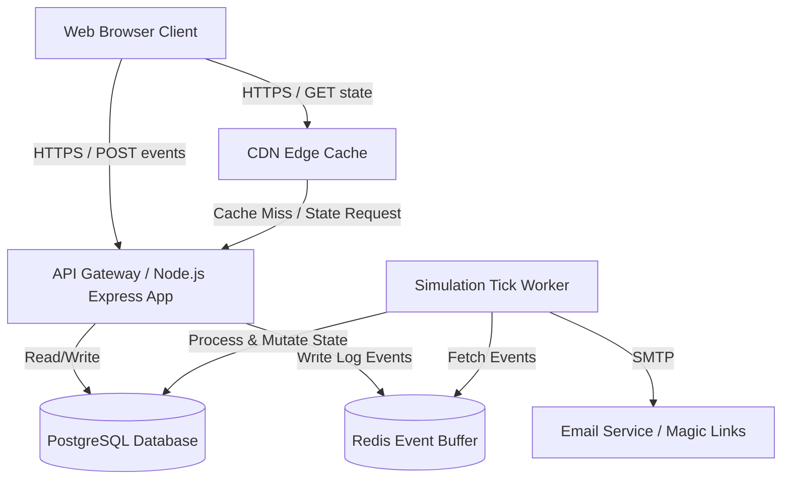
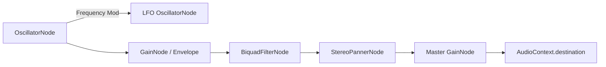

# Pocket Aviary: Comprehensive V1 Implementation Plan

This document outlines the detailed system architecture, data models, APIs, and algorithmic specifications for building **Pocket Aviary**. It serves as the canonical blueprint for the engineering team.

---

## 1. Scope and Boundaries

### 1.1 In-Scope for V1
- **Aviary Capacity**: Starts with exactly 2 birds. Supports adopting up to 7 birds maximum.
- **Core Interactions**:
  - **Presence**: Real-time passive tracking of user attention.
  - **Listen-in**: Focusing a specific bird to adjust the audio mix.
  - **Offers**: Cooldown-limited interaction items: seed, song fragment, and still pool.
  - **Settle**: An opt-in soft exit gesture that shifts lighting and settles the aviary.
- **Accounts**:
  - Email-based magic-link authentication (15-minute token expiration).
  - Multi-device synchronization reading from a single server-ticked canonical state.
  - Synthetic account IDs (UUIDv4) to prevent PII leakage.
- **Naturalist Surfaces**:
  - **Field Notebook**: A sparse, auto-generated, read-only diary of naturalist observations.
  - Naturalist-style product copy (lowercase, present-tense, observational, bird-centered).
- **Social**:
  - Read-only visitor links sent via email. No co-presence or live interaction.
- **Accessibility & Performance**:
  - **Screen-Reader Narration**: Dynamic prose descriptions of the active state.
  - **Reduced-Motion Mode**: Visual transition cross-fades replacing frame-by-frame animations.
  - **Call Captions**: Generative text overlays describing call qualities.
  - Aggressive performance optimization: initial bundle <2MB, first-bird-render <500ms, 60fps on 5-year-old laptops.

### 1.2 Out-of-Scope (Explicitly Excluded)
- **Native Applications**: No native mobile wrappers. Web-only for V1.
- **Gamification**: No streaks, achievements, XP, levels, scores, visit calendars, or user progress metrics.
- **Tamagotchi-Style custodial mechanics**: Birds do not die, decay, get sick, or show distress on neglect.
- **Social Networking**: No user profiles, discovery feeds, mutual follows, comments, or shared/collaborative aviaries.

---

## 2. Architecture & Tech Stack



### 2.1 Technology Stack
- **Frontend Core**: Vanilla HTML5, CSS3 Custom Properties, and ES6+ TypeScript. Compiled and bundled via **Vite**.
- **Audio Synthesis**: WebAudio API for real-time client-side procedural sound generation.
- **Backend API Server**: Node.js with TypeScript and Express.
- **Simulation Tick Engine**: Background processing queue running on a Node-based worker task runner.
- **Database**: PostgreSQL (for durable data storage).
- **Caching & Event Buffering**: Redis (for API session tokens, rate limiting, and buffering event queues).

---

## 3. Data Model

### 3.1 Database Schema (PostgreSQL DDL)

```sql
-- Core Accounts Table
CREATE TABLE accounts (
    id UUID PRIMARY KEY DEFAULT gen_random_uuid(),
    encrypted_email TEXT NOT NULL UNIQUE, -- PII protection
    created_at TIMESTAMP WITH TIME ZONE NOT NULL DEFAULT NOW(),
    deleted_at TIMESTAMP WITH TIME ZONE DEFAULT NULL -- Soft delete for 30 days
);

-- Device Session Tokens
CREATE TABLE sessions (
    id UUID PRIMARY KEY DEFAULT gen_random_uuid(),
    account_id UUID NOT NULL REFERENCES accounts(id) ON DELETE CASCADE,
    session_token VARCHAR(256) NOT NULL UNIQUE,
    device_info TEXT,
    created_at TIMESTAMP WITH TIME ZONE NOT NULL DEFAULT NOW(),
    last_active_at TIMESTAMP WITH TIME ZONE NOT NULL DEFAULT NOW(),
    revoked_at TIMESTAMP WITH TIME ZONE DEFAULT NULL
);

-- Bird Instances Table
CREATE TABLE birds (
    id UUID PRIMARY KEY DEFAULT gen_random_uuid(),
    account_id UUID NOT NULL REFERENCES accounts(id) ON DELETE CASCADE,
    name VARCHAR(64) NOT NULL,
    species_id VARCHAR(32) NOT NULL,
    
    -- Hidden Personality Vector (Values bounded between 0.00 and 1.00)
    boldness NUMERIC(3, 2) NOT NULL CHECK (boldness >= 0.00 AND boldness <= 1.00),
    social_warmth NUMERIC(3, 2) NOT NULL CHECK (social_warmth >= 0.00 AND social_warmth <= 1.00),
    vocal_frequency NUMERIC(3, 2) NOT NULL CHECK (vocal_frequency >= 0.00 AND vocal_frequency <= 1.00),
    plumage_saturation NUMERIC(3, 2) NOT NULL CHECK (plumage_saturation >= 0.00 AND plumage_saturation <= 1.00),
    curiosity NUMERIC(3, 2) NOT NULL CHECK (curiosity >= 0.00 AND curiosity <= 1.00),
    
    -- Short-term State
    current_mood VARCHAR(32) NOT NULL DEFAULT 'content',
    last_mood_update TIMESTAMP WITH TIME ZONE NOT NULL DEFAULT NOW(),
    
    -- Spatial Layout Reference
    current_perch_zone VARCHAR(16) NOT NULL DEFAULT 'middle' CHECK (current_perch_zone IN ('front', 'middle', 'back')),
    
    created_at TIMESTAMP WITH TIME ZONE NOT NULL DEFAULT NOW()
);

-- Append-Only Interaction Event Log
CREATE TABLE interaction_events (
    id UUID PRIMARY KEY DEFAULT gen_random_uuid(),
    account_id UUID NOT NULL REFERENCES accounts(id) ON DELETE CASCADE,
    bird_id UUID REFERENCES birds(id) ON DELETE SET NULL,
    event_type VARCHAR(32) NOT NULL, -- 'presence_ping', 'listen_in_start', 'listen_in_end', 'offer_seed', 'offer_song', 'offer_pool', 'settle'
    payload JSONB DEFAULT '{}'::jsonb,
    created_at TIMESTAMP WITH TIME ZONE NOT NULL DEFAULT NOW()
);

-- Field Notebook Entries
CREATE TABLE notebook_entries (
    id UUID PRIMARY KEY DEFAULT gen_random_uuid(),
    account_id UUID NOT NULL REFERENCES accounts(id) ON DELETE CASCADE,
    entry_text TEXT NOT NULL,
    created_at TIMESTAMP WITH TIME ZONE NOT NULL DEFAULT NOW()
);

-- Visit Invitations Table
CREATE TABLE visit_invitations (
    id UUID PRIMARY KEY DEFAULT gen_random_uuid(),
    host_account_id UUID NOT NULL REFERENCES accounts(id) ON DELETE CASCADE,
    guest_email_hash VARCHAR(64) NOT NULL,
    token VARCHAR(128) NOT NULL UNIQUE,
    status VARCHAR(16) NOT NULL DEFAULT 'pending' CHECK (status IN ('pending', 'active', 'revoked', 'expired')),
    created_at TIMESTAMP WITH TIME ZONE NOT NULL DEFAULT NOW(),
    expires_at TIMESTAMP WITH TIME ZONE NOT NULL,
    revoked_at TIMESTAMP WITH TIME ZONE DEFAULT NULL
);

-- Visit Log
CREATE TABLE visit_log (
    id UUID PRIMARY KEY DEFAULT gen_random_uuid(),
    invitation_id UUID NOT NULL REFERENCES visit_invitations(id) ON DELETE CASCADE,
    visitor_device_info TEXT,
    started_at TIMESTAMP WITH TIME ZONE NOT NULL DEFAULT NOW(),
    ended_at TIMESTAMP WITH TIME ZONE DEFAULT NULL
);
```

---

## 4. API Surface

### 4.1 Authentication & Session Management
- `POST /api/auth/request-link`
  - Body: `{ "email": "user@domain.com" }`
  - Behavior: Verifies or creates account (via UUID and encrypted email block). Sends a one-time link with a 15-minute validity window. Rate-limited to 3 requests per 15 minutes.
- `POST /api/auth/verify-link`
  - Body: `{ "token": "abc123xyz" }`
  - Returns: `{ "session_token": "token_string", "user_uuid": "uuid_v4" }` Set in Cookie (HTTPOnly, Secure, SameSite=Strict).
- `POST /api/auth/logout`
  - Revokes current session token.

### 4.2 Aviary & Interaction API
- `GET /api/aviary/state`
  - Returns current snapshot of the aviary.
  - Response Body:
    ```json
    {
      "time_of_day": "morning",
      "weather": "clear",
      "birds": [
        {
          "id": "bird-uuid-1",
          "name": "pip",
          "species_id": "warbler",
          "mood": "content",
          "perch_zone": "front",
          "plumage_saturation": 0.65
        },
        {
          "id": "bird-uuid-2",
          "name": "wren",
          "species_id": "thrush",
          "mood": "wary",
          "perch_zone": "back",
          "plumage_saturation": 0.52
        }
      ]
    }
    ```
- `POST /api/aviary/events`
  - Body: `{ "events": [ { "type": "presence_ping", "timestamp": "...", "payload": {} } ] }`
  - Behavior: Validates token, appends events to the backend log.

### 4.3 Social API
- `POST /api/social/invite`
  - Body: `{ "email": "friend@domain.com" }`
  - Behavior: Generates custom link `https://pocketaviary.com/visit/:token`.
- `POST /api/social/revoke`
  - Body: `{ "invitation_id": "uuid" }`
- `GET /api/guest/state/:token`
  - Behavior: Retrieves read-only snapshot for the host's aviary. Rate-limited. Blocked from write endpoints.

---

## 5. Simulation Engine Design

### 5.1 Server-Side Simulation Tick
- A cron execution triggers the simulation update loop every **60 seconds** for all accounts that have registered client activity in the last 15 minutes.

#### Step-by-Step Tick Operations:
1. Fetch all un-processed events from `interaction_events` for the target account.
2. Group pings to compute **Effective Attention Window (EAW)**. Each `presence_ping` represents a maximum 30-second block of validated active presence.
3. Compute the **Drift Factor** and update the database:
   $$\text{Trait}_{t+1} = \text{Trait}_{t} + \alpha \cdot \text{EAW} \cdot (1 - \text{Trait}_{t})$$
   - *Calibration constants*: $\alpha_{\text{presence}} = 1.0 \times 10^{-6}$ (translates to about 1% vector movement per 3 hours of continuous focus).
   - Monotonic check: The delta is strictly clamped to $\ge 0$.
4. Resolve specific interaction modifiers:
   - For `listen_in_start` event logs, calculate duration $D$. Apply additional $\beta = 1.5 \times \alpha$ delta specifically to the target bird's `social_warmth` and `vocal_frequency` values.
   - For successful `offer` completions, apply $\gamma = 0.005$ to the bird's `curiosity` value (if accepted) and `boldness` value.
5. **Mood Engine Execution**:
   - Determine baseline probability distributions based on timezone (e.g. dawn, day, dusk, night) and active weather events.
   - Run transition logic using a discrete state Markov chain for each bird.
     ```
     [ wary ]    <--->    [ content ]    <--->    [ curious ]
        ^                      ^                      ^
        |                      v                      |
     [ alert ]   <--->    [ drowsy ]   <------------->+
     ```
   - Boldness scales down the transition probability to the `wary` state.
   - Social warmth increases the likelihood of entering the `curious` or `content` states when neighboring birds are vocalizing.
6. Write the final state payload back to the database. Flag processed events.

### 5.2 Dynamic Field Notebook Generation
- A separate offline script runs every 24 hours.
- Evaluates recent activity records. If a landmark transition has occurred (e.g., first greeting of the week, weather change, a shift in perch zones), it uses a templated naturalist grammar engine to assemble a lowercase text entry:
  - *Template*: `[day_name] — [bird_name] [action] today. [context_note].`
  - *Example output*: `thursday — wren perched on the high branch, calling softly. a leaf drifted down past the back perch and neither bird looked up.`
- Writes the generated string directly to `notebook_entries`. Entry density is strictly limited to 1 entry every 2-3 days for active users to prevent log fatigue.

---

## 6. Multi-Device Sync Model

```
   [Device A]                              [Server DB]                             [Device B]
       |                                        |                                       |
       |--- POST Event (Listen-in Pip) ------->|                                       |
       |                                        |                                       |
       |                                        |--- Tick processes event ------------->|
       |                                        |    (Mutates Pip's state)              |
       |                                        |                                       |
       |                                        |<-- GET /api/aviary/state (Poll) ------|
       |                                        |                                       |
       |                                        |--- Returns State Snapshot ------------|
       |                                        |    (Device B renders Pip close)       |
```

- **Single Writer Pattern**: Only the server-side simulation tick modifies the state of the birds.
- **Append-Only Client Updates**: Clients submit *behavioral actions* rather than *state values*. This prevents race conditions and overwrites.
- **Device Conflict Resolution**:
  - The client operates as a reactive rendering engine.
  - Snapshots are fetched on page focus, visible state transitions, or every 30 seconds.
  - If two devices are open simultaneously, their individual presence pings are recorded and processed sequentially. The server aggregates the attention without collision.

---

## 7. Frontend Rendering Pipeline

### 7.1 Scene Composition (Responsive SVG Overlay)
- The viewport container utilizes CSS grid layouts.
- Background, Midground, and Foreground are modeled as nested `<g>` elements in a responsive parent `<svg viewBox="0 0 1920 1080" preserveAspectRatio="xMidYMid slice">`.

### 7.2 Idle Micro-motion
- Birds are composed of separate SVG sub-shapes (beak, wing, head, body, tail).
- Idle animations are driven via CSS Transforms (rotation, translate) with randomized animation delay offsets using inline CSS variables:
  ```css
  .bird-beak {
    transform-origin: center;
    animation: head-tilt var(--duration) infinite ease-in-out;
    animation-delay: var(--delay);
  }
  ```

### 7.3 Motion Interpolation
- When a state snapshot shows a change in perch position, the client intercepts the state update.
- Instead of repositioning immediately, the client computes a Bezier translation path between the coordinates of Perch A and Perch B.
- Using `requestAnimationFrame`, the bird's SVG coordinates are interpolated along the path over 800ms using a standard ease-in-out function.

### 7.4 Reduced-Motion Mode
- If `prefers-reduced-motion` is active:
  1. Set target attribute `[data-reduced-motion="true"]` on the root HTML.
  2. Disable all continuous keyframe CSS animations.
  3. Replace the coordinate translation paths with a CSS opacity transition:
     ```css
     .bird-sprite {
       transition: opacity 1.2s ease-in-out;
     }
     ```
  4. Cross-fade between Perch A (opacity: 0) and Perch B (opacity: 1) during position updates.

---

## 8. Audio Pipeline

### 8.1 Procedural Synthesis Engine
- Built entirely using native WebAudio API nodes.
- Calls are mathematically synthesized rather than loaded from external audio files.



#### Pitch Sweep Logic:
```javascript
const ctx = new AudioContext();
const osc = ctx.createOscillator();
const gainNode = ctx.createGain();

// Generate a sweep for a Warbler call
osc.frequency.setValueAtTime(800, ctx.currentTime);
osc.frequency.exponentialRampToValueAtTime(1600, ctx.currentTime + 0.15);

// Envelope Shaping
gainNode.gain.setValueAtTime(0, ctx.currentTime);
gainNode.gain.linearRampToValueAtTime(0.8, ctx.currentTime + 0.02);
gainNode.gain.exponentialRampToValueAtTime(0.001, ctx.currentTime + 0.15);

osc.connect(gainNode);
gainNode.connect(ctx.destination);
osc.start();
osc.stop(ctx.currentTime + 0.16);
```

### 8.2 Spatial Panning & Mixing
- Each bird maps its horizontal center coordinate directly to the `StereoPannerNode.pan.value` between `-1.0` (far left) and `1.0` (far right).
- Birds in the back perch zone have a static low-pass filter frequency set to `2500Hz` with a lower master gain multiplier (`0.3`) to simulate depth.

### 8.3 Listen-in Mix Decay
- When a bird is focused:
  - Loop through other active birds and ramp down their gain variables exponentially:
    `otherGainNode.gain.exponentialRampToValueAtTime(0.05, ctx.currentTime + 1.5)`
  - Ramp up target bird's gain to full volume:
    `targetGainNode.gain.exponentialRampToValueAtTime(1.0, ctx.currentTime + 1.5)`
- On focus release, smoothly return all gains back to normal ambient mix levels.

---

## 9. Accessibility Surfaces

### 9.1 Narration Engine
- Implement a visually hidden `<div id="aria-narration" aria-live="polite">` element.
- The state manager translates spatial layouts and mood updates into descriptive prose:
  - *Prose Rule*: `[Lighting_condition]. [bird_1] is [perch_position_1], [action_1]. [bird_2] is [perch_position_2], [action_2].`
  - *Narrative output*: `it is twilight in the aviary. pip is perched on the front rail, preening. wren sits further back with eyes closed.`
- Throttled update cadence: 45 seconds at idle. Immediate trigger upon interactions.

### 9.2 Call Captioning
- Capture active sound synthesis triggers. Map the grammar pattern to text overlays:
  - `Trill` -> `[bird_name] makes a rapid soft trill`
  - `Chirp` -> `[bird_name] calls sharply`
- Render text inside absolute layout coordinates above the specific bird:
  ```html
  <div class="call-caption" style="left: 45%; top: 30%;">
    a soft three-note rise
  </div>
  ```
- Contrast is strictly enforced: `background: rgba(0, 0, 0, 0.8)`, `color: #ffffff`, passing WCAG AA requirements.

---

## 10. Performance Budgets & Observability

### 10.1 Key Metrics
- **Initial JS Bundle**: <2MB (Gzipped, excluding media assets). Achieved via aggressive tree-shaking and dynamic route importing for Settings/Notebook code.
- **Time-to-First-Bird**: <500ms over 3G/4G connections. Render loop initiates immediately with fallback inline styling. State snapshots are loaded inline in the server's initial HTML response payload to avoid additional fetch requests.
- **Runtime Performance**: 60fps target on 5-year-old laptops. Memory checks enforced in CI to prevent growth over a 30-minute running session.

---

## 11. Rollout & Validation Plan

### 11.1 Verification Strategy
- **Unit Testing**:
  - Verify monotonic vector updates in simulation tests.
  - Assert that negative updates are impossible.
- **Integration & Browser Tests**:
  - Run automated Headless Chrome tests utilizing Lighthouse to verify Time-to-First-Bird (<500ms) and Bundle targets.
  - Run regression tests on WebAudio fallsbacks by disabling the Audio Context and verifying call caption triggers.
- **Manual Verification**:
  - Check the application layout on small mobile and large screen devices, validating that no birds are cropped out of the viewport.

---

## 12. Risks and Mitigations

| Risk | Impact | Mitigation |
| :--- | :--- | :--- |
| **Drift Calibration Imbalance** | High | Conduct simulated user interaction scripts spanning 60 virtual days. Validate that drift remains slow and does not exceed the target visual increments. |
| **Sync Race Conditions** | Medium | Maintain the single-writer database pattern. Clients are blocked from updating coordinates directly. |
| **Robotic Sound Generation** | Medium | Introduce micro-timing jitter (randomized small offsets of 10-25ms) and frequency variation within the WebAudio synthesis code. |
| **PII Data Leakage** | High | Restrict email addresses to the main account table. Use UUIDv4 values across all system processes and metrics trackers. |
