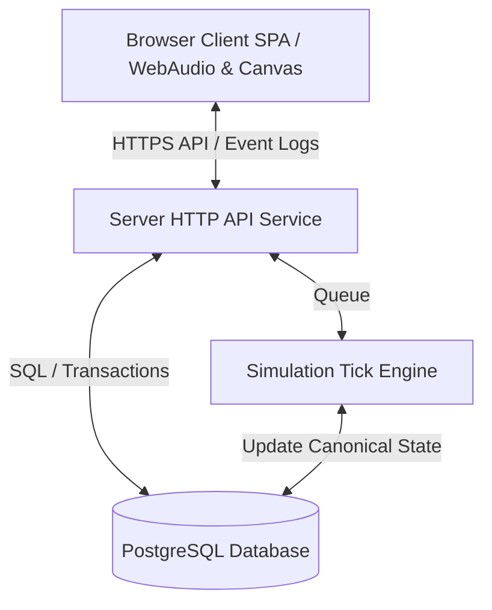

# Pocket Aviary - Phase 1 Implementation Plan (v1)

This document details the complete, production-ready implementation plan for the Pocket Aviary product. It covers architectural design, data modeling, simulation mechanics, front-end rendering, audio synthesis, accessibility, performance, and rollout strategies.

---

## 1. Scope

Pocket Aviary is an ambient, browser-based experience focused on observation and attention rather than gamification or custodial chore loops.

### In Scope for v1
*   **Aviary Context**:
    *   Single horizontal responsive canvas fitting on one screen without panning, zoom, or scrolling.
    *   Three perch zones (front, middle, back) determining bird placement based on mood/personality.
    *   Day/night lighting cycle synced to the user's browser local time.
    *   Subtle ambient micro-motion (leaf drift, feather drift, soft leaf-rippling wind, gentle parallax).
*   **Bird Engine**:
    *   Stable bird identity via unique persistent IDs.
    *   Starting population of exactly 2 birds. Progression cap of exactly 7 birds.
    *   Hidden slowly-drifting numerical personality vector: boldness, social warmth, vocal frequency, plumage saturation, curiosity.
    *   Monotonic positive drift based on presence-time, listen-in, and offers. Neglect drops birds into ambient quietness but never wariness or visual degradation.
    *   Fast-timescale mood state per bird (wary, content, curious, drowsy, alert) resetting daily-ish.
    *   Procedural client-side audio synthesis using the WebAudio API (no recorded loops).
*   **Interactions**:
    *   Naturalist return-greeting staggered offset based on boldness, mood, and absence duration.
    *   Listen-in: focusing a bird brings its call up in the audio mix and pan-centers it while dampening others.
    *   Offers: seed, song fragment, still pool. Triggering cooldowns (a few minutes per bird).
    *   Settle: user-initiated lighting shift to evening that triggers a soft close and ends presence (reversable within 5s).
    *   Presence: conjunct tracking of `visibilityState === 'visible'`, window focus, and mouse/key activity.
    *   Field Notebook: auto-generated, read-only naturalist observations generated sparingly (one every few days, lowercase, present-tense).
*   **System & Account Surfaces**:
    *   Single-user accounts via email magic link (15-min link lifespan, single-use invalidation).
    *   Revocable per-device session tokens.
    *   JSON state snapshot export.
    *   Soft-deletion for 30 days, hard-deletion thereafter.
*   **Social (Optional & Quiet)**:
    *   Read-only visit invitation (by email, one-time link, 30-day expiration, instant revocation).
    *   No visitor presence, chat, comments, or shared cursors.
*   **Accessibility**:
    *   ARIA live narration in naturalist prose.
    *   Reduced-motion rendering (poses cross-fade, no leaf particles).
    *   Call captions styled inline near calling birds.
    *   WebAudio fallback (silence with call captions enabled by default).
    *   WCAG AA contrast matching.
    *   Complete keyboard navigation.

### Out of Scope (Non-Goals)
*   **No Native App**: Web-only (modern mobile/desktop browsers).
*   **No Gamification**: No streaks, achievements, green-dot calendars, badges, XP, levels, or rank lists.
*   **No Tamagotchi Mechanics**: No bird deaths, hunger meters, or custodial duty indicators. Neglect causes quietness, not suffering.
*   **No Social Network Features**: No comments, mutual visits, public discovery lists, profiles, shared cursors, or leaderboards.
*   **No Push Notifications**: The aviary only exists when visited. No emails/push notices about neglect or bird states.

---

## 2. Architecture



### Service Shape
The product consists of:
1.  **Frontend Single Page Application (SPA)**: Serves static assets (HTML, CSS, compiled JS) from a CDN edge. Runs completely in client memory. Uses WebAudio API for procedural sound synthesis and HTML5 Canvas for the rendering loop.
2.  **Server API Service**: Handles requests for authentication (magic links), session management, event log writes, and snapshot reads.
3.  **Simulation Tick Engine**: A background worker (or lazy evaluation mechanism) that executes the state simulation tick and processes the event log to update the database.

### Client/Server Split
*   **Server Core Responsibilities**:
    *   Storing and securing client records (synthetic UUIDs, encrypted emails).
    *   Serving as the sole writer of the canonical state (birds, personality vectors, moods).
    *   Executing simulation loops (ticks) and writing entries to the Field Notebook.
    *   Managing social token verification and host-visitor isolation.
*   **Client Core Responsibilities**:
    *   Rendering visual frames based on state snapshots.
    *   Calculating and applying client-side animations (e.g. leaf drifting, skeletal micro-movements) and cross-fades.
    *   Synthesizing procedural audio signals locally based on parameters from the server snapshot.
    *   Detecting user inputs and window focus changes to update presence status.
    *   Buffering and posting user interaction events to the server-side event log.

### Render Pipeline Boundary
The render boundary lies between the **snapshot parameters** supplied by the server and the **local interpolation/particle/synthesizer execution** on the client:
*   The server dictates *what state* the aviary is in: e.g. "Pip is on the front perch, mood is curious, current call motif is A2."
*   The client calculates *how to render* it: e.g. interpolating Pip's flight curve from the middle perch to the front perch over 120 frames, animating head-tilting idle micro-motions, running particle emitters for leaf drift, and generating the FM synth voice for motif A2.

---

## 3. Data Model

### Database Schema (PostgreSQL)

```sql
-- Accounts Table
CREATE TABLE accounts (
    account_id UUID PRIMARY KEY DEFAULT gen_random_uuid(),
    email_encrypted BYTEA NOT NULL, -- AES-256-GCM encrypted
    created_at TIMESTAMP WITH TIME ZONE DEFAULT CURRENT_TIMESTAMP,
    deleted_at TIMESTAMP WITH TIME ZONE DEFAULT NULL
);

-- Sessions Table
CREATE TABLE sessions (
    session_id UUID PRIMARY KEY DEFAULT gen_random_uuid(),
    account_id UUID NOT NULL REFERENCES accounts(account_id) ON DELETE CASCADE,
    token_hash VARCHAR(64) UNIQUE NOT NULL, -- SHA-256 of session token
    user_agent TEXT,
    expires_at TIMESTAMP WITH TIME ZONE NOT NULL,
    revoked_at TIMESTAMP WITH TIME ZONE DEFAULT NULL,
    created_at TIMESTAMP WITH TIME ZONE DEFAULT CURRENT_TIMESTAMP
);

-- Birds Table
CREATE TABLE birds (
    bird_id UUID PRIMARY KEY DEFAULT gen_random_uuid(),
    account_id UUID NOT NULL REFERENCES accounts(account_id) ON DELETE CASCADE,
    name VARCHAR(100) NOT NULL,
    species_id VARCHAR(50) NOT NULL, -- 'pip', 'wren', etc.
    boldness DOUBLE PRECISION NOT NULL DEFAULT 0.2,
    social_warmth DOUBLE PRECISION NOT NULL DEFAULT 0.2,
    vocal_frequency DOUBLE PRECISION NOT NULL DEFAULT 0.2,
    plumage_saturation DOUBLE PRECISION NOT NULL DEFAULT 0.2,
    curiosity DOUBLE PRECISION NOT NULL DEFAULT 0.2,
    current_mood VARCHAR(50) NOT NULL DEFAULT 'content',
    last_perch_zone VARCHAR(20) NOT NULL DEFAULT 'middle',
    last_tick_time TIMESTAMP WITH TIME ZONE DEFAULT CURRENT_TIMESTAMP,
    CONSTRAINT chk_boldness CHECK (boldness BETWEEN 0.0 AND 1.0),
    CONSTRAINT chk_social CHECK (social_warmth BETWEEN 0.0 AND 1.0),
    CONSTRAINT chk_vocal CHECK (vocal_frequency BETWEEN 0.0 AND 1.0),
    CONSTRAINT chk_plumage CHECK (plumage_saturation BETWEEN 0.0 AND 1.0),
    CONSTRAINT chk_curiosity CHECK (curiosity BETWEEN 0.0 AND 1.0)
);

-- Interaction / Presence Event Log Table (Append-only)
CREATE TABLE interaction_events (
    event_id UUID PRIMARY KEY DEFAULT gen_random_uuid(),
    account_id UUID NOT NULL REFERENCES accounts(account_id) ON DELETE CASCADE,
    session_id UUID REFERENCES sessions(session_id) ON DELETE SET NULL,
    event_type VARCHAR(50) NOT NULL, -- 'presence_ping', 'offer', 'listen_in_start', 'listen_in_end', 'settle'
    bird_id UUID REFERENCES birds(bird_id) ON DELETE SET NULL,
    metadata JSONB, -- duration, offer_type ('seed', 'water', 'song')
    created_at TIMESTAMP WITH TIME ZONE DEFAULT CURRENT_TIMESTAMP
);

-- Field Notebook Entries
CREATE TABLE notebook_entries (
    entry_id UUID PRIMARY KEY DEFAULT gen_random_uuid(),
    account_id UUID NOT NULL REFERENCES accounts(account_id) ON DELETE CASCADE,
    prose_text TEXT NOT NULL,
    created_at TIMESTAMP WITH TIME ZONE DEFAULT CURRENT_TIMESTAMP
);

-- Visit Invitations
CREATE TABLE visit_invitations (
    invite_id UUID PRIMARY KEY DEFAULT gen_random_uuid(),
    host_account_id UUID NOT NULL REFERENCES accounts(account_id) ON DELETE CASCADE,
    visitor_email_encrypted BYTEA NOT NULL,
    visitor_email_hash VARCHAR(64) NOT NULL, -- for easy lookup matching
    status VARCHAR(20) NOT NULL DEFAULT 'pending', -- 'pending', 'revoked', 'expired'
    expires_at TIMESTAMP WITH TIME ZONE NOT NULL,
    created_at TIMESTAMP WITH TIME ZONE DEFAULT CURRENT_TIMESTAMP
);

-- Visit Log
CREATE TABLE visit_log (
    visit_log_id UUID PRIMARY KEY DEFAULT gen_random_uuid(),
    invite_id UUID NOT NULL REFERENCES visit_invitations(invite_id) ON DELETE CASCADE,
    visited_at TIMESTAMP WITH TIME ZONE DEFAULT CURRENT_TIMESTAMP,
    duration_seconds INT NOT NULL DEFAULT 0
);
```

---

## 4. API Surface

The API utilizes JSON request and response payloads, communicating over HTTPS.

### Authentication & Sessions
*   `POST /api/auth/magic-link`
    *   *Payload*: `{"email": "user@example.com"}`
    *   *Response*: `{"status": "ok"}`
    *   *Behavior*: Encrypts email, checks/creates account, generates verification token with 15-minute expiration, emails magic link.
*   `POST /api/auth/verify`
    *   *Payload*: `{"token": "magic_token_string"}`
    *   *Response*: `{"status": "ok"}` + Sets httpOnly, Secure, SameSite=Strict cookie with session token.
*   `GET /api/account/sessions`
    *   *Response*: `[{"session_id": "uuid", "user_agent": "...", "created_at": "...", "is_current": true}]`
*   `DELETE /api/account/sessions/:id`
    *   *Response*: `{"status": "revoked"}`

### Aviary Simulation & Events
*   `GET /api/aviary/snapshot`
    *   *Response*:
        ```json
        {
          "aviary": {
            "time_of_day": "2026-05-20T06:48:32-07:00",
            "weather": "clear",
            "is_settled": false
          },
          "birds": [
            {
              "bird_id": "uuid-1",
              "name": "Pip",
              "species_id": "wren",
              "plumage_saturation": 0.45,
              "current_mood": "curious",
              "perch_zone": "front"
            },
            {
              "bird_id": "uuid-2",
              "name": "Wren",
              "species_id": "warbler",
              "plumage_saturation": 0.35,
              "current_mood": "content",
              "perch_zone": "middle"
            }
          ]
        }
        ```
*   `POST /api/aviary/events`
    *   *Payload*:
        ```json
        {
          "events": [
            {
              "event_type": "presence_ping",
              "duration_seconds": 60,
              "timestamp": "2026-05-20T06:47:00Z"
            },
            {
              "event_type": "offer",
              "bird_id": "uuid-1",
              "metadata": {
                "offer_type": "seed"
              },
              "timestamp": "2026-05-20T06:47:30Z"
            }
          ]
        }
        ```
    *   *Response*: `{"status": "accepted"}`

### Field Notebook
*   `GET /api/notebook?limit=20&offset=0`
    *   *Response*: `[{"entry_id": "uuid", "prose_text": "pip greeted before wren today...", "created_at": "..."}]`

### Social Visits
*   `POST /api/social/invite`
    *   *Payload*: `{"email": "friend@example.com"}`
    *   *Response*: `{"invite_id": "uuid", "expires_at": "..."}`
*   `POST /api/social/invite/:id/revoke`
    *   *Response*: `{"status": "revoked"}`
*   `GET /api/social/visit/:invite_id`
    *   *Response*: Read-only aviary snapshot payload (equivalent schema to `GET /api/aviary/snapshot`, but interactions are disabled for the client).

---

## 5. Simulation Engine Design

### Server-Side Tick Architecture
The simulation runs server-side on a slow periodic tick (e.g., $1$ minute). To maximize efficiency and prevent background polling issues, the simulation runs **lazily**:
1.  When a client requests a snapshot or posts events, the server checks the `last_tick_time` for the aviary.
2.  If the gap exceeds $1$ minute, the server executes a fast-forward tick chain:
    $$\Delta t = \text{now} - \text{last\_tick\_time}$$
    $$N_{\text{ticks}} = \lfloor \Delta t / 60\,\text{seconds} \rfloor$$
3.  Each simulated tick transitions bird moods, processes buffered events in order, and appends delta-based updates to the database records.

```
Request Received -> Gap Check -> Run N Ticks Lazily -> Apply Deltas -> Return Snapshot
```

### Drift Function (Slow Timescale)
Drift is monotonic, slow, and incremental. Personality values only increase or stay constant.

For each bird, traits $P \in \{\text{boldness}, \text{social\_warmth}, \text{vocal\_frequency}, \text{plumage\_saturation}, \text{curiosity}\}$ are updated based on client-sent interaction logs:
*   **Presence Time ($T_{\text{pres}}$)**: Sum of accumulated seconds of valid presence verified by the server. Nudges all traits.
*   **Listen-in Time ($T_{\text{listen}}$)**: Focused duration. Nudges `social_warmth` and `vocal_frequency` for that bird.
*   **Offers ($N_{\text{offer}}$)**: Number of successfully accepted offers. Nudges `curiosity` and `boldness`.

$$\Delta P = \alpha_P \cdot T_{\text{pres}} + \beta_P \cdot T_{\text{listen}} + \gamma_P \cdot N_{\text{offer}}$$

```
Parameters calibration (normalized delta per hour of focused attention):
- Boldness:          alpha = 0.005, beta = 0.0,   gamma = 0.01
- Social Warmth:     alpha = 0.002, beta = 0.015, gamma = 0.0
- Vocal Frequency:   alpha = 0.004, beta = 0.008, gamma = 0.0
- Plumage Saturation: alpha = 0.008, beta = 0.0,   gamma = 0.0
- Curiosity:         alpha = 0.003, beta = 0.0,   gamma = 0.02
```

This guarantees that:
*   $\approx 7$ hours of total presence (1 week of 1-hour daily checks) yields a measurable trait delta of $+0.035$ (measurable in instruments).
*   $\approx 21$ hours of presence (3 weeks) yields a delta of $+0.11$, showing up as a visible shift in perching behaviors, coloration, and vocalisation frequencies.

### Mood Transition Engine (Fast Timescale)
Mood transitions are modeled as a Markov Chain evaluated at each tick:

$$M_{t+1} = \text{Transition}(M_t, P, \text{Inputs})$$

*   **Inputs**: Time of day, weather, recent events (e.g. offer accepted, settle gesture).
*   **Personality Bias**:
    *   High Boldness: Decreases the probability of transitioning into the `wary` state by $80\%$.
    *   High Social Warmth: Increases transition probability into `curious` when another bird calls.
*   **Moods**:
    *   `wary`: Stays in the back perch zone. Quiet.
    *   `content`: Preens, stays in the middle or front perch zone.
    *   `curious`: Focuses on cursor movements, head-tilting.
    *   `drowsy`: Sitting low, eyes closed. Triggers near dusk.
    *   `alert`: High vocal frequency, looking around. Triggers at morning or during wind/rain.

### Call-Grammar Runtime
Bird vocalizations are synthesized on the client using procedural rules. The server defines the high-level seed parameters in the state snapshot:

```json
{
  "bird_id": "uuid",
  "mood": "content",
  "vocal_frequency_trait": 0.45,
  "pitch_offset_hz": 12,
  "current_motif_library": "wren_content_motifs"
}
```

The client's audio scheduler uses these traits to dynamically assemble motif chains (sequences of sine-wave frequencies, duration envelopes, and volume ramps) so the vocalizations remain procedurally unique while keeping their distinct "species voice" intact.

---

## 6. Sync Model

### Multi-device State Synchronization
*   The server database contains the single source of truth for the aviary.
*   Clients do not store or update state values locally. They retrieve JSON snapshots via GET requests and push events to the append-only table via POST.
*   When a user opens the aviary on a phone while running it on a laptop:
    *   The phone requests `/api/aviary/snapshot`.
    *   The server runs any caught-up simulation ticks and returns the current canonical positions, moods, and environment variables.
    *   The phone begins rendering the exact same scene.

### Conflict Prevention (No Last-Write-Wins)
By using an event-sourcing/append-only event model for interactions:
1.  **Direct mutations are prohibited**: Clients never send requests like `UPDATE birds SET boldness = 0.65`.
2.  **Server processes event trails**: Clients write logs containing presence times and interaction records.
3.  **Deterministic execution order**: The server simulation tick consumes these logs sequentially, modifying bird stats monotonically. This ensures that concurrent logins on multiple devices merely contribute to the same append-only log without overwriting each other's state changes.

---

## 7. Frontend Rendering Pipeline

Pocket Aviary uses an HTML5 Canvas drawing loop optimized for low-power operation and responsive viewports.

### Scene Composition & Layout
*   The scene is drawn using a logical coordinates frame of $1920 \times 1080$ pixels.
*   The canvas aspect ratio is maintained via CSS properties `aspect-ratio: 16 / 9` and `max-width: 100vw; max-height: 100vh; object-fit: contain`.
*   Three depth layers are drawn in order:
    1.  **Background Layer**: Soft sky gradients, far trees, clouds.
    2.  **Middle Layer**: Middle perches, bird characters, falling leaves.
    3.  **Foreground Layer**: Front perches, overlay branches, rain droplets.

```
[Background Sky/Clouds] -> [Back Perch] -> [Middle Perch/Birds] -> [Front Perch] -> [Foreground Leaves]
```

### Idle Micro-motion
*   Micro-motions (head bobbing, breathing, feather-fluffing, tail-whips) are computed client-side using parameterized math formulas (sine waves and noise maps) inside a requestAnimationFrame loop.
*   Bones or node segments are translated and rotated dynamically, keeping visual assets extremely lightweight (SVG outlines drawn programmatically).

### Transitions & Viewport Adaptation
*   **Flight Interpolation**: When a bird changes perches, the client calculates a quadratic Bezier curve path connecting Perch A and Perch B:
    $$B(t) = (1-t)^2 P_A + 2(1-t)t P_{\text{control}} + t^2 P_B$$
    and moves the bird along this path over 1.5 seconds.
*   **Reduced-Motion Override**:
    *   If `prefers-reduced-motion` is active, the Bezier calculation is bypassed.
    *   The bird at Perch A slowly fades out (`opacity` goes from 1 to 0) while a second instance at Perch B fades in (`opacity` goes from 0 to 1) over a 2.0-second interval.
    *   Particle emitters for wind-blown leaves and rain are deactivated.

---

## 8. Audio Pipeline

The sound system generates audio procedurally on the client side.

### Procedural Call Synthesis
The pipeline maps a sequence of pitch/gain nodes using standard WebAudio nodes:

```
OscillatorNode (Sine/Triangle) -> BiquadFilterNode -> GainNode (Volume Envelope) -> PannerNode (Spatial Position) -> AudioDestination (Output)
```

To create an organic bird-like whistle:
1.  **Frequency Modulation**: A fast LFO (Low-Frequency Oscillator) modulates the primary oscillator's frequency to introduce natural vibrato.
2.  **Motif Definition**: A motif is a sequence of frequencies and gain changes:
    ```javascript
    const motif = [
      { time: 0.0, freq: 850, gain: 0.0 },
      { time: 0.05, freq: 1100, gain: 0.8 },
      { time: 0.15, freq: 1300, gain: 0.9 },
      { time: 0.25, freq: 950, gain: 0.0 }
    ];
    ```
3.  We apply parameter sweeps using `linearRampToValueAtTime` to connect the nodes smoothly.

### Listen-In Mixing & Decay
Focusing on a bird updates the audio mix values:
*   **Focused Bird Volume**: Ramps from normal ($0.4$) to focus volume ($1.0$) over $1.5$ seconds using `gainNode.gain.setTargetAtTime(1.0, ctx.currentTime, 0.5)`.
*   **Other Birds Volume**: Ramps down to ambient level ($0.1$) over $2.0$ seconds.
*   **Panning**: The focused bird's `PannerNode` moves to center ($0.0$), while the remaining birds are panned further to the left/right extremes to create a spacious background soundscape.

### WebAudio Fallback
*   If `AudioContext` fails to initialize or is blocked by browser policies:
    *   The app suppresses all audio synthesis.
    *   A quiet status indicator displays "audio muted" in a clean, non-obtrusive matter-of-fact styling.
    *   **Call Captions are automatically turned ON** to ensure the user does not miss the audio interaction signals.

---

## 9. Accessibility Surfaces

Pocket Aviary provides full access to its mechanics through structured alternative representations.

### Screen-Reader Narration
*   An `aria-live="polite"` container is embedded in the HTML tree.
*   Every $45$ seconds, the client updates this container with a generated descriptive paragraph in the naturalist voice:
    > "a small wren sits on the front rail, looking alert. another bird rests quietly on the high branch. the midday light is warm and clear."
*   Events like successful offers or the settle gesture write immediate updates to the live region.

### Keyboard Navigation & Focus
*   All interactive elements (birds, top-bar buttons, settings panel fields) are in the focus order (`tabindex="0"`).
*   **Keyboard Layout Map**:
    *   `Tab`: Cycles focus (Top Bar -> Front Bird -> Middle Bird -> Back Bird).
    *   `Enter`: Focuses and engages "listen-in" on the focused bird.
    *   `Escape`: Exits "listen-in", closes settings panels or notebook view.
    *   `Space`: Activates the selected option/action.
*   A high-contrast focus ring is drawn around the focused bird or button using CSS outlines with a fallback canvas outline draw.

---

## 10. Performance Budgets and Observability

### Asset and Load Targets
*   **JS Bundle Size Limit**: $\le 2.0\,\text{MB}$ total gzipped transfer size.
*   **First Paint Target**: $\le 500\,\text{ms}$ on a mid-tier mobile device over a 4G connection.
    *   *Strategy*: Inline critical CSS, inject the initial state payload into the HTML page at the server level, and defer settings/notebook code imports.
*   **Frame Rate Budget**: Stable $60\,\text{fps}$ during active rendering on a 5-year-old laptop (tested on Chrome/Safari/Firefox).
*   **Memory Growth**: Zero memory leak over $30\,\text{minutes}$ of continuous idle operation.
    *   *Strategy*: Reuse WebAudio synth nodes instead of recreating them, and clear old canvas buffers.

### Observability Metrics (Anonymized)
Operational metrics are collected through aggregate logging:
*   `page_load_ms`: Time from navigation start to canvas initialization.
*   `first_bird_visible_ms`: Time until the first bird SVG outline is rendered.
*   `tick_computation_ms`: Latency of server simulation calculations.
*   `audio_context_errors`: Count of WebAudio load failures.

No individual bird names, presence history, or account-identifying telemetry values are exported.

---

## 11. Rollout Plan

1.  **Phase 1: Local Testing & Calibration**:
    *   Run test scripts verifying that the lazily-evaluated catch-up tick matches sequential ticks exactly.
    *   Verify the monotonic properties of the drift vector under automated session scenarios.
2.  **Phase 2: Private Beta**:
    *   Release the web version to a small beta user group with magic-link verification enabled.
    *   Observe aggregate performance logs (p99 tick computation time $\le 5.0\,\text{seconds}$).
3.  **Phase 3: Public Release**:
    *   Promote the web interface to production.
    *   Ramp maximum bird caps from $2$ to $7$ progressively based on user cohort feedback.

---

## 12. Risks and Mitigations

| Risk | Impact | Mitigation |
| :--- | :--- | :--- |
| **Drift Calibration Imbalance** | High | If drift updates too quickly, the experience becomes a game. If too slow, it feels like a static screensaver. We mitigate this by validating numerical increments in integration tests and keeping calibration variables in a centralized, easily adjustable server-side config file. |
| **Multi-device Session Race Conditions** | Medium | Concurrent operations on two active tabs (e.g. laptop and phone) could cause database race conditions. We mitigate this by using a strictly sequential, append-only interaction event log and relying on PostgreSQL transactional isolation levels (`SERIALIZABLE`) to run the catch-up ticks. |
| **Robotic Procedural Audio** | Medium | Procedural synthesis can sound too cold or mechanical. We mitigate this by introducing small random variations (jitter) to base frequencies ($\pm 1.5\%$) and envelope durations, ensuring that no two synthesized calls sound identical. |
| **Accessibility Degradation** | High | Visual additions to the canvas could drift out of sync with screen-reader descriptions. We mitigate this by forcing the ARIA narration to use the exact same state models that feed the visual canvas render paths. |
