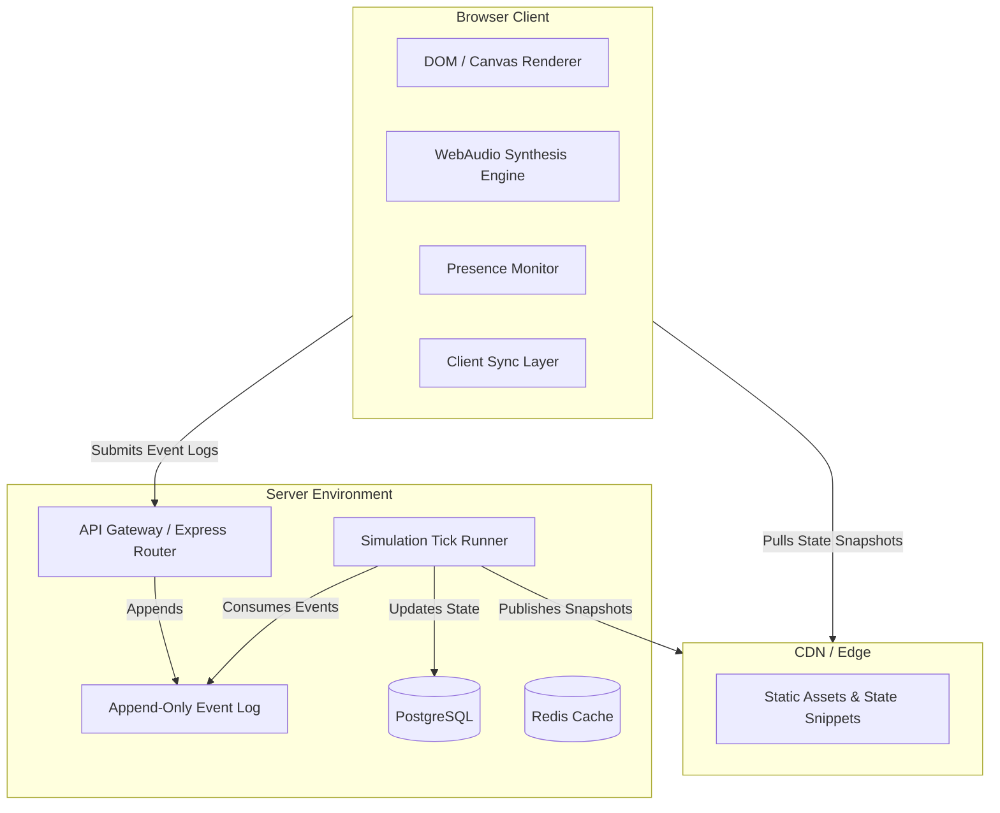

# Pocket Aviary - V1 Implementation Plan

This document outlines the comprehensive technical design and implementation plan for Pocket Aviary V1. It translates the product requirements, design philosophy, and constraints outlined in the PRD into an executable, production-grade specification for the engineering team.

---

## 1. Scope

Pocket Aviary V1 focuses strictly on establishing a slow-timescale relationship between the user and a small flock of virtual birds. The core value of the product is idle attention (presence) rather than gamified custodial tasks.

### In Scope for V1
- **Bird Adoption & Identity**: Start with 2 starter birds, expandable up to a strict cap of 7. Species selected automatically from a pool of 6. Birds have stable, unique internal IDs and user-changeable names.
- **Presence Tracking**: Honest tracking combining tab visibility, window focus, and user activity (keyboard/pointer) within a rolling window.
- **Slow personality drift**: Monotonic progression toward expressiveness (traits never decrease on neglect; neglect makes birds quiet and ambient).
- **Fast-timescale moods**: Daily-ish cycle modulated by local time, weather, and recent interactions.
- **Procedural Calls**: Synthesized client-side via the WebAudio API based on species-specific motifs.
- **Interactions**:
  - Return-greeting (staggered, procedurally varied).
  - Listen-in (gradual volume cross-fade focusing a single bird).
  - Offers (seed, song fragment, still pool) with per-bird cooldowns.
  - Settle (user-initiated soft session end with 5s undo grace period).
  - Field Notebook (naturalist-narrated, sparse, read-only observations).
- **Accounts & Sync**: Single-user, magic-link email auth (15-min link expiry, invalidate-on-use), synthetic account UUIDs (PII isolation), multi-device sync via a canonical server-side simulation.
- **Accessibility**:
  - Screen-reader narration (narrative prose, slow queue-managed cadence).
  - Reduced-motion mode (cross-fade transitions and pose shifting, no ambient leaf drift).
  - Call captions (prose descriptions of calling motifs).
  - Full keyboard navigation and WCAG AA contrast compliance.
- **Social (Visits)**: Read-only ambient visits (invite-only by email, 30-day link expiry, revocable, no co-presence, visitor presence doesn't affect host drift).

### Out of Scope (Explicit Non-Goals)
- **Native Applications**: Web only.
- **Gamification**: No streaks, counters, levels, XP, calendars of green dots, milestones, or badges.
- **Custodial/Tamagotchi Mechanics**: No hunger, sickness, or bird death. Neglect makes birds quiet and ambient rather than distressed.
- **Social Network Layers**: No public directories, leaderboards, mutual feeds, visitor avatars, chat, or host push notifications for visitor events.

---

## 2. Architecture



### Server/Client Split
- **Server Role**: Holds canonical authority. Houses the authentication gateway, receives raw interaction events, executes the simulation tick runner (~1 min intervals), and persists accounts, birds, and notebook states.
- **Client Role**: Thin client. Monitors visibility/activity to record presence, handles local rendering (interpolating bird positions between snapshots), schedules and synthesizes WebAudio calls, manages accessibility queues, and forwards interaction events to the server.
- **Render Pipeline Boundary**: The client does not simulate bird behavior, drift, or mood changes. It accepts a snapshot JSON representing the current state and renders it using CSS transitions and HTML Canvas, updating positions smoothly by interpolating between current and next coordinates.

---

## 3. Data Model

Pocket Aviary uses a PostgreSQL schema for transactional consistency and strict PII isolation.

```sql
-- Core Accounts Table
CREATE TABLE accounts (
    id UUID PRIMARY KEY DEFAULT gen_random_uuid(),
    encrypted_email TEXT NOT NULL, -- Encrypted using AES-GCM
    created_at TIMESTAMP WITH TIME ZONE NOT NULL DEFAULT NOW(),
    deleted_at TIMESTAMP WITH TIME ZONE -- NULL unless soft-deleted (30-day recovery window)
);

-- Active User Sessions
CREATE TABLE sessions (
    id UUID PRIMARY KEY DEFAULT gen_random_uuid(),
    account_id UUID NOT NULL REFERENCES accounts(id) ON DELETE CASCADE,
    token_hash VARCHAR(64) NOT NULL,
    device_info TEXT,
    created_at TIMESTAMP WITH TIME ZONE NOT NULL DEFAULT NOW(),
    expires_at TIMESTAMP WITH TIME ZONE NOT NULL,
    revoked_at TIMESTAMP WITH TIME ZONE
);

-- Birds Table
CREATE TABLE birds (
    id UUID PRIMARY KEY DEFAULT gen_random_uuid(),
    account_id UUID NOT NULL REFERENCES accounts(id) ON DELETE CASCADE,
    species VARCHAR(32) NOT NULL, -- e.g., 'wren', 'pipit', 'nightjar'
    name VARCHAR(64) NOT NULL,
    adopted_at TIMESTAMP WITH TIME ZONE NOT NULL DEFAULT NOW(),
    -- Hidden Personality Vector (0.0 to 1.0)
    boldness DOUBLE PRECISION NOT NULL DEFAULT 0.2,
    social_warmth DOUBLE PRECISION NOT NULL DEFAULT 0.2,
    vocal_frequency DOUBLE PRECISION NOT NULL DEFAULT 0.2,
    plumage_saturation DOUBLE PRECISION NOT NULL DEFAULT 0.2,
    curiosity DOUBLE PRECISION NOT NULL DEFAULT 0.2,
    -- Fast-Timescale State
    current_mood VARCHAR(32) NOT NULL DEFAULT 'wary',
    last_mood_updated_at TIMESTAMP WITH TIME ZONE NOT NULL DEFAULT NOW()
);

-- Append-Only Interaction Events
CREATE TABLE interaction_events (
    id UUID PRIMARY KEY DEFAULT gen_random_uuid(),
    account_id UUID NOT NULL REFERENCES accounts(id) ON DELETE CASCADE,
    bird_id UUID REFERENCES birds(id) ON DELETE SET NULL,
    event_type VARCHAR(64) NOT NULL, -- 'presence_ping', 'listen_in_start', 'offer_seed', etc.
    duration_seconds DOUBLE PRECISION,
    created_at TIMESTAMP WITH TIME ZONE NOT NULL DEFAULT NOW(),
    processed BOOLEAN NOT NULL DEFAULT FALSE
);

-- Field Notebook Entries
CREATE TABLE notebook_entries (
    id UUID PRIMARY KEY DEFAULT gen_random_uuid(),
    account_id UUID NOT NULL REFERENCES accounts(id) ON DELETE CASCADE,
    entry_text TEXT NOT NULL,
    created_at TIMESTAMP WITH TIME ZONE NOT NULL DEFAULT NOW()
);

-- Visits (Social Feature)
CREATE TABLE visits (
    id UUID PRIMARY KEY DEFAULT gen_random_uuid(),
    host_account_id UUID NOT NULL REFERENCES accounts(id) ON DELETE CASCADE,
    visitor_email TEXT NOT NULL, -- Encrypted
    token_hash VARCHAR(64) NOT NULL,
    created_at TIMESTAMP WITH TIME ZONE NOT NULL DEFAULT NOW(),
    expires_at TIMESTAMP WITH TIME ZONE NOT NULL, -- 30 days from creation
    revoked_at TIMESTAMP WITH TIME ZONE
);

CREATE TABLE visit_logs (
    id UUID PRIMARY KEY DEFAULT gen_random_uuid(),
    visit_id UUID NOT NULL REFERENCES visits(id) ON DELETE CASCADE,
    visitor_ip_hash VARCHAR(64) NOT NULL,
    started_at TIMESTAMP WITH TIME ZONE NOT NULL DEFAULT NOW(),
    ended_at TIMESTAMP WITH TIME ZONE
);
```

---

## 4. API Surface

The API acts as an ingestion gateway for interaction logs and a distribution channel for readonly snapshots.

### Authentication Endpoint
`POST /api/auth/magic-link`
- **Body**: `{ "email": "user@domain.com" }`
- **Behavior**: Encrypts email, checks rate limits (max 3 per 15 mins per email), generates a secure 15-minute token, invalidates any existing token for this email, and sends an email with the link.
- **Response**: `200 OK` (Always, to prevent email enumeration).

`POST /api/auth/verify`
- **Body**: `{ "token": "..." }`
- **Behavior**: Validates and immediately invalidates the token. Generates a secure session token and sets it as an HTTP-only, secure, SameSite=Strict cookie.
- **Response**: `200 OK` + `{ "account_id": "UUID" }`.

### Aviary and Simulation Endpoints
`GET /api/aviary/snapshot`
- **Headers**: Authorization Cookie.
- **Behavior**: Returns the active snapshot of the aviary. If visited as a guest (via a valid visit token), returns a restricted read-only subset.
- **Response**:
```json
{
  "aviary_time": "2026-05-20T14:47:00Z",
  "weather": "clear",
  "birds": [
    {
      "id": "bird-uuid-1",
      "species": "wren",
      "name": "Pip",
      "current_mood": "curious",
      "visual_state": {
        "perch_zone": "front",
        "plumage_saturation": 0.35
      }
    }
  ]
}
```

`POST /api/aviary/events`
- **Headers**: Authorization Cookie.
- **Body**:
```json
{
  "events": [
    {
      "event_type": "presence_ping",
      "duration_seconds": 60,
      "timestamp": "2026-05-20T14:46:00Z"
    }
  ]
}
```
- **Behavior**: Appends incoming events to the database event log for execution during the next simulation tick.

### Social / Visit Endpoints
`POST /api/visits/invite`
- **Body**: `{ "visitor_email": "friend@domain.com" }`
- **Behavior**: Creates a 30-day token, sends it to the visitor.
- **Response**: `200 OK` + `{ "invite_id": "UUID" }`.

`POST /api/visits/revoke`
- **Body**: `{ "invite_id": "UUID" }`
- **Behavior**: Sets `revoked_at = NOW()` on the visit row. Terminates active guest sessions immediately.

---

## 5. Simulation Engine Design

### The Server-Side Tick Loop
A worker process executes the simulation loop once per minute for active accounts:

```typescript
async function processSimulationTick(accountId: string) {
  const birds = await db.getBirds(accountId);
  const events = await db.getUnprocessedEvents(accountId);
  
  // 1. Calculate accumulated presence and interaction values
  let presenceSeconds = 0;
  const birdInteractions: Record<string, { listenSeconds: number, offers: string[] }> = {};
  
  for (const bird of birds) {
    birdInteractions[bird.id] = { listenSeconds: 0, offers: [] };
  }
  
  for (const event of events) {
    if (event.event_type === 'presence_ping') {
      presenceSeconds += event.duration_seconds;
    } else if (event.event_type === 'listen_in') {
      birdInteractions[event.bird_id].listenSeconds += event.duration_seconds;
    } else if (event.event_type.startsWith('offer_')) {
      birdInteractions[event.bird_id].offers.push(event.event_type);
    }
  }

  // 2. Compute slow-timescale personality drift
  for (const bird of birds) {
    const presenceMin = presenceSeconds / 60;
    const listenMin = birdInteractions[bird.id].listenSeconds / 60;
    const offers = birdInteractions[bird.id].offers;
    
    // Low-pass monotonic drift formulas (values are clamped between starting value and 1.0)
    const deltaBoldness = (presenceMin * 0.0005) + (offers.length * 0.005);
    const deltaSocialWarmth = (presenceMin * 0.0003) + (listenMin * 0.002);
    const deltaVocalFreq = (presenceMin * 0.0004) + (listenMin * 0.001);
    const deltaPlumage = (presenceMin * 0.0006);
    const deltaCuriosity = (presenceMin * 0.0002) + (offers.filter(o => o === 'offer_seed').length * 0.01);
    
    bird.boldness = Math.min(1.0, bird.boldness + deltaBoldness);
    bird.social_warmth = Math.min(1.0, bird.social_warmth + deltaSocialWarmth);
    bird.vocal_frequency = Math.min(1.0, bird.vocal_frequency + deltaVocalFreq);
    bird.plumage_saturation = Math.min(1.0, bird.plumage_saturation + deltaPlumage);
    bird.curiosity = Math.min(1.0, bird.curiosity + deltaCuriosity);

    // 3. Compute fast-timescale mood transition
    bird.current_mood = calculateNewMood(bird, presenceMin, offers);
    
    await db.updateBirdState(bird);
  }

  // 4. Periodically evaluate Field Notebook entry creation
  await evaluateNotebookGeneration(accountId, birds, events);
  
  // 5. Mark events as processed
  await db.markEventsProcessed(events.map(e => e.id));
}
```

### Drift Calibration Target
- **Measurable changes**: In 1 week (assuming ~15 mins of daily presence), a bird's boldness will increase by approximately `15 * 7 * 0.0005 = 0.0525` (representing ~5% of its total scale). This change is captured in backend evaluation tests.
- **Visible changes**: In 3 weeks, boldness increases by `~0.16`. This pushes the bird into a new perching probability band, where it is visibly observed on the front perch significantly more often.

### Call Grammar Runtime
- **Motif Definition**: A motif is represented as a structured sequence:
  ```json
  {
    "motif_id": "wren_trill_high",
    "notes": [
      { "pitch": 880, "duration": 0.05, "type": "sine" },
      { "pitch": 987, "duration": 0.05, "type": "sine" },
      { "pitch": 1046, "duration": 0.15, "type": "triangle" }
    ],
    "mood_modifiers": {
      "wary": { "pitch_offset": 50, "delay_multiplier": 1.5 },
      "drowsy": { "pitch_offset": -100, "delay_multiplier": 2.5 }
    }
  }
  ```
- **Interval scheduling**: The gap between calls is modeled as a random variable matching an exponential distribution, where vocal frequency $V_f$ shortens the mean gap $\mu$:
  $$\mu = 30 \times (1.0 - V_f) + 10 \text{ seconds}$$
- **Chorus behavior**: When Bird A executes a call, it sends an event to the audio coordinator. Nearby birds evaluate response triggers: if a bird's social warmth is high, it schedules a response call at a small randomized offset ($0.2$s to $1.2$s), creating a natural staggered chorus.

---

## 6. Sync Model

### Single Canonical State (Server-Authoritative)
The database stores a single, immutable snapshot per bird. Because all drift calculations are executed server-side via incoming logs, conflict loops like "Last-Write-Wins" are conceptually impossible. 

### Handshake & Local Ingestion Queue
1. When a client tab changes `visibilityState` to `visible` or recovers focus, it requests `GET /api/aviary/snapshot`.
2. The client pulls the snapshot and aligns its rendering parameters.
3. If the connection fails, the client queues user events (e.g. `listen_in_start`, `offer`) in an in-memory queue.
4. On reconnection, these events are flushed to `POST /api/aviary/events`.
5. If the session expires or is revoked during a network gap, the client clears the queue and presents the matter-of-fact re-authorization interface.

---

## 7. Frontend Rendering Pipeline

### Layout and Coordinates
The aviary scene is rendered on an HTML5 Canvas using a vector representation scaled to the bounding box of the page.
- **Width**: Responsive. Horizontal boundaries adapt, positioning the left/right perches closer or further apart to ensure all birds remain visible.
- **Height**: Aspect ratio constrained to prevent vertical scaling from clipping the tree branches.
- **Three Perch Zones**: Scaled $Y$ layers representing depth:
  - **Back Perch Zone**: $Y = 30\%$, smaller scale ($0.7\times$), low saturation.
  - **Middle Perch Zone**: $Y = 55\%$, medium scale ($1.0\times$), nominal saturation.
  - **Front Perch Zone**: $Y = 80\%$, larger scale ($1.3\times$), high saturation.

### Interpolation & Micro-Motion
- **Movement**: When a bird changes perches, the client does not teleport the canvas image. It calculates a quadratic bezier curve between the starting perch and the target perch over a $1.2$-second duration.
- **Micro-motion**: While perched, a noise function (Perlin or simplex) drives minor offsets in head tilt ($0^\circ - 15^\circ$) and tail feather flicking. The amplitude and speed of these offsets are mapped directly to the bird's current mood.

### Reduced-Motion Mode
When `window.matchMedia('(prefers-reduced-motion: reduce)')` is true or the user overrides the accessibility settings:
- **No Leaf/Rain Particle rendering**: Particle loops are bypassed.
- **Cross-fade Perch Transitions**: When a bird moves, its rendering at Perch A fades out (`opacity` $1.0 \to 0.0$) while concurrently fading in at Perch B (`opacity` $0.0 \to 1.0$) over 1 second.
- **Pose Cross-fades**: Micro-animations are disabled. The bird shifts between static sprites (preening, resting, looking) via slow 2-second opacity cross-fades rather than skeletal movements.

---

## 8. Audio Pipeline

### Client-Side Procedural Synthesis
Recorded files are bypassed entirely. Audio is synthesized on the fly using WebAudio API nodes.

```typescript
class BirdVoice {
  private ctx: AudioContext;
  private destination: AudioNode;

  constructor(ctx: AudioContext, destination: AudioNode) {
    this.ctx = ctx;
    this.destination = destination;
  }

  public playNote(freq: number, duration: number, type: OscillatorType = 'sine') {
    const osc = this.ctx.createOscillator();
    const gain = this.ctx.createGain();
    
    osc.type = type;
    osc.frequency.setValueAtTime(freq, this.ctx.currentTime);
    
    // Natural exponential envelope decay
    gain.gain.setValueAtTime(0.001, this.ctx.currentTime);
    gain.gain.exponentialRampToValueAtTime(0.15, this.ctx.currentTime + 0.01);
    gain.gain.exponentialRampToValueAtTime(0.001, this.ctx.currentTime + duration);
    
    osc.connect(gain);
    gain.connect(this.destination);
    
    osc.start();
    osc.stop(this.ctx.currentTime + duration);
  }
}
```

### Mixing and Panning
- **Stereo Spatialization**: Each bird is assigned a static horizontal position mapped to a WebAudio `StereoPannerNode` matching its perch coordinate.
- **Listen-In Re-balance**: A centralized mixer handles the focus state.
  - **Focused Bird**: Panned to center; volume ramps up (`gain` $+6$dB) over a $1.5$-second linear fade.
  - **Other Birds**: Volume drops slowly by $12$dB (`gain` linear decay to $25\%$ of current volume) but stays audible as ambient background.

### WebAudio Fallback
If browser flags or device blockages prevent the `AudioContext` from resuming:
- Stop calling synthesis handlers.
- Silently switch the local UI state.
- **Auto-activate captions**: Enable call captions automatically, overlaying text logs representing the procedural sounds on screen.

---

## 9. Accessibility Surfaces

Pocket Aviary's accessibility targets are integrated directly into the core user experience loop.

### Screen-Reader Narration
- **Element**: A visually hidden `<div id="aviary-narration" aria-live="polite">` is maintained.
- **Narrative Assembly**: Every 45 seconds, the client reads the current bird array and active environments to construct a text block:
  > "it is late afternoon in the aviary. pip is perched on the front rail preening. wren calls softly from the back perch."
- **Event-Driven Overrides**: High-priority user events (e.g. starting a Settle command) override the timer, pushing the narration event immediately into the live area.

### Call Captions
- When call captions are enabled, a small HTML block is rendered directly adjacent to the bird's bounding box.
- Text corresponds to the active synthesized motif (e.g., `*a slow three-note rise from Pip*`).
- Captions follow CSS fade animations synchronized with the gain node envelopes of the synthesizer.

### Focus and Navigation
- Tab order flows from the Header UI -> Aviary Canvas -> Birds (sorted left to right).
- Active birds receive a visible focus outline: a dual-border SVG path (outer white, inner black) ensuring high contrast on both sunny and nighttime background frames.
- Keybind mapping:
  - **Arrow Keys**: Move focus between birds.
  - **Enter**: Triggers `listen-in` on the focused bird.
  - **Escape**: Disengages focus, reverting audio mix to standard ambient levels.

---

## 10. Performance Budgets and Observability

### Strict Budgets
| Metric | Budget Target | Mitigation Strategy |
| :--- | :--- | :--- |
| **Initial Gzipped JS Bundle** | `< 2MB` | Code-split settings dialogs, exclude heavy asset packs, synthesize audio instead of storing sound files. |
| **Time-to-First-Bird (TTFB)** | `< 500ms` (4G mid-tier) | Embed the first state snapshot JSON directly inside the server-rendered HTML template. |
| **Animation Rate** | `60fps` | Use simple 2D canvas draws rather than complex DOM-node translations. |
| **Memory Growth** | `0MB` change over 30 mins | Track and recycle AudioContext nodes, clear inactive canvas reference keys on component teardowns. |

### Observability Boundary
We track aggregate operational metrics strictly separated from user identifier logs:
- **Server telemetry**: Duration of simulation-tick runs, PostgreSQL read/write latencies. An alert fires at the DevOps level if p99 simulation tick execution exceeds 5 seconds.
- **Client telemetry**: Average paint frame rate (measured via local performance loops), initialization failure rates for WebAudio nodes.
- **PII isolation**: Analytics dashboards never expose account UUIDs or individual bird names. Telemetry payloads only carry generic OS/Browser labels and performance numbers.

---

## 11. Rollout

To ensure stability, the launch sequence is split into controlled phases:

```mermaid
chronology
    title V1 Rollout Sequence
    Phase 1 : Technical Design & Base Scaffolding (1 Week)
    Phase 2 : Local Simulation & Wave Synthesis Tests (2 Weeks)
    Phase 3 : Accounts Integration & Closed Beta (2 Weeks)
    Phase 4 : Production Release & Performance Scaling (1 Week)
```

1. **Phase 1: Architecture & Scaffolding**: Setup databases, structure synthetic UUID generators, and implement magic-link email pathways.
2. **Phase 2: Local Simulation & Synthesizer Prototyping**: Build the baseline WebAudio species-timbre engine. Standardize the first 2 starter species (Wren and Pipit).
3. **Phase 3: Multi-Device Sync & Accessibility Verification**: Deploy the server-side simulation tick. Execute automated screen-reader assertions and verify LWW prevention on cross-tab usage.
4. **Phase 4: Release & Scaling**: Deploy the application. Monitor performance budgets (TTFB and bundle limits) using edge-routed CDNs.

---

## 12. Risks and Mitigations

### 1. Drift Calibration Over-acceleration
- **Risk**: If drift occurs too quickly, users will treat it as a game to optimize. If too slow, the site feels like a static wallpaper.
- **Mitigation**: Execute virtual user integration tests in CI. Simulate a 30-day user interaction log (varying from 1 to 30 mins of daily focus) and assert that personality variables fall precisely inside target distribution curves before packaging releases.

### 2. Audio Timbre Uncanniness
- **Risk**: Procedural oscillators can sound like retro video game bleeps rather than organic bird vocalizations.
- **Mitigation**: Couple basic oscillators with low-pass filters mapped to an envelope generator, simulating the physical resonances of a bird's vocal tract. Utilize ConvolverNodes with rich forest impulse responses to place sound sources in a natural space.

### 3. Sync Drift on Multi-Device Session Collision
- **Risk**: Concurrent active sessions on a phone and a laptop could submit conflicting event logs.
- **Mitigation**: Process the event logs strictly in append-only order. The server-side simulation tick resolves events sequentially using database transactions to prevent race conditions on updates.

### 4. Accessibility Screen-Reader Fatigue
- **Risk**: Constantly updating the live-announcement region will clutter the client's screen-reader queue.
- **Mitigation**: Limit standard narration changes to a maximum frequency of 45-second intervals during idle sessions. Ensure that only explicit actions (like choosing Settle) trigger immediate updates.
