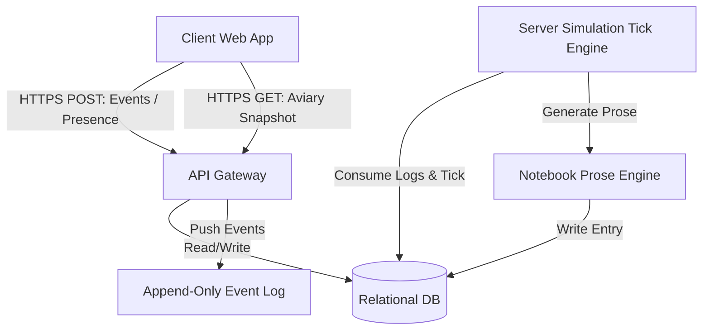

# Pocket Aviary - Engineering Implementation Plan (v1)

This document provides a comprehensive technical blueprint for the Pocket Aviary product, details the client/server split, data schema, procedural audio architecture, sync mechanics, and accessibility surfaces. It is designed to guide a senior engineering team through implementation.

---

## 1. Scope

### In-Scope (v1)
*   **Aviary Scene & Bird Lifecycle:**
    *   One horizontal, single-screen responsive aviary canvas per user account.
    *   Bird count ranging from 2 (starter) to 7 (maximum cap).
    *   Bird adoption unlocked purely by aviary age (e.g., 2 weeks for bird 3, 6 weeks for bird 4, etc.).
    *   Species pool of 6 distinct species, each with unique visual layouts, plumage assets, and call grammars.
*   **Interactions:**
    *   **Return-Greeting:** Non-canned, staggered greeting when the client reconnects, based on length of user absence and individual bird boldness.
    *   **Listen-in:** Focus mode that cross-fades other birds' audio to low ambient volume, while raising the focused bird's procedural sound.
    *   **Offers:** Seeds, song fragments, and still-pool water with a per-bird cooldown (e.g., 5 minutes) to protect drift metrics.
    *   **Settle:** Manual evening lighting shift and audio quiet down with a 5-second undo grace period.
    *   **Field Notebook:** Naturalist, sparse observations (~1 every few days) generated by the server.
*   **Core Systems:**
    *   Single-user account magic-link authentication via email (15-minute expiry, single-use token).
    *   Server-side simulation tick running at a slow cadence (~1 minute) to process the canonical aviary status.
    *   Client presence tracking requiring visible tab, focus, and pointer/keyboard activity window.
    *   Read-only visit system sharing the host aviary state via secure unique links sent to visitor emails.
*   **Accessibility & Performance:**
    *   Designed reduced-motion mode replacing high-frequency animations with slow cross-fades of posture.
    *   Prose-based screen-reader narration updating every 30–60 seconds.
    *   Dynamic procedural call captioning rendered visual-adjacent to birds.
    *   Initial JavaScript bundle size < 2MB gzipped, < 500ms time-to-first-bird render.

### Out-of-Scope (v1 Non-Goals)
*   **No Native Applications:** Desktop/mobile wrappers are excluded; standard mobile/desktop browsers only.
*   **No Gamification:** No XP, streaks, levels, visit counters, milestone calendars, or visual validation of "daily visits."
*   **No Custodial Needs:** Birds cannot die, get hungry, show distress, or decay in mood due to user absence.
*   **No Social Networks:** No public discovery feeds, shared profiles, comments, avatars, or co-presence (visitors cannot interact or see other visitors).

---

## 2. Architecture & Service Shape

### Client/Server Split
Pocket Aviary operates on a thin-client, thick-server model.
*   **Server Responsibilities:**
    *   Auth, session management, and PII encryption.
    *   Evaluating the cron-style simulation loop (Tick).
    *   Consuming client event streams to compute and update personality drift and mood states.
    *   Maintaining the canonical state database.
    *   Generating Field Notebook prose observations.
*   **Client Responsibilities:**
    *   Rendering visual assets, handling viewport responsive dimensions, and animating sprites.
    *   Synthesizing procedural audio calls locally using the WebAudio API based on motif structures sent by the server.
    *   Calculating and checking user presence requirements (Tab Visibility API, Document Focus, and activity event listener).
    *   Interpolating positions between discrete server ticks for smooth animation.



---

## 3. Data Model

### Database Schema (Relational PostgreSQL Design)

```sql
-- 1. Accounts Table (Strict Synthetic UUID Isolation)
CREATE TABLE accounts (
    id UUID PRIMARY KEY DEFAULT gen_random_uuid(),
    encrypted_email BYTEA NOT NULL, -- AES-256 encrypted email address
    email_hash VARCHAR(64) UNIQUE NOT NULL, -- SHA-256 lookup index
    created_at TIMESTAMP WITH TIME ZONE NOT NULL DEFAULT NOW(),
    deleted_at TIMESTAMP WITH TIME ZONE, -- Soft delete threshold (30 days)
    status VARCHAR(20) NOT NULL DEFAULT 'active' CHECK (status IN ('active', 'pending_deletion'))
);

-- 2. Sessions Table
CREATE TABLE sessions (
    id UUID PRIMARY KEY DEFAULT gen_random_uuid(),
    account_id UUID NOT NULL REFERENCES accounts(id) ON DELETE CASCADE,
    token_hash VARCHAR(64) UNIQUE NOT NULL,
    device_info TEXT,
    created_at TIMESTAMP WITH TIME ZONE NOT NULL DEFAULT NOW(),
    last_seen TIMESTAMP WITH TIME ZONE NOT NULL DEFAULT NOW(),
    revoked_at TIMESTAMP WITH TIME ZONE
);

-- 3. Aviary State Table
CREATE TABLE aviaries (
    account_id UUID PRIMARY KEY REFERENCES accounts(id) ON DELETE CASCADE,
    last_tick_time TIMESTAMP WITH TIME ZONE NOT NULL DEFAULT NOW(),
    is_settled BOOLEAN NOT NULL DEFAULT FALSE,
    weather_type VARCHAR(20) NOT NULL DEFAULT 'clear' CHECK (weather_type IN ('clear', 'soft_wind', 'rain')),
    weather_start_time TIMESTAMP WITH TIME ZONE,
    weather_end_time TIMESTAMP WITH TIME ZONE
);

-- 4. Birds Table (Holds Canonical Personality Vectors and Current Moods)
CREATE TABLE birds (
    id UUID PRIMARY KEY DEFAULT gen_random_uuid(),
    aviary_id UUID NOT NULL REFERENCES aviaries(account_id) ON DELETE CASCADE,
    name VARCHAR(50) NOT NULL,
    species_type VARCHAR(30) NOT NULL CHECK (species_type IN ('warbler', 'wren', 'pip', 'nightjar', 'thrush', 'finch')),
    adopted_at TIMESTAMP WITH TIME ZONE NOT NULL DEFAULT NOW(),
    
    -- Personality Vector (Float values, strictly 0.0 to 1.0)
    boldness NUMERIC(3, 2) NOT NULL DEFAULT 0.20,
    social_warmth NUMERIC(3, 2) NOT NULL DEFAULT 0.20,
    vocal_frequency NUMERIC(3, 2) NOT NULL DEFAULT 0.20,
    plumage_saturation NUMERIC(3, 2) NOT NULL DEFAULT 0.20,
    curiosity NUMERIC(3, 2) NOT NULL DEFAULT 0.20,
    
    -- Fast Timescale States
    current_mood VARCHAR(20) NOT NULL DEFAULT 'content' CHECK (current_mood IN ('wary', 'content', 'curious', 'drowsy', 'alert', 'sleeping')),
    current_perch VARCHAR(20) NOT NULL DEFAULT 'middle' CHECK (current_perch IN ('front', 'middle', 'back')),
    last_interaction_time TIMESTAMP WITH TIME ZONE
);

-- 5. Append-Only Interaction Event Log (Source of truth for ticks)
CREATE TABLE interaction_events (
    id BIGSERIAL PRIMARY KEY,
    account_id UUID NOT NULL REFERENCES accounts(id) ON DELETE CASCADE,
    event_type VARCHAR(30) NOT NULL,
    target_bird_id UUID REFERENCES birds(id) ON DELETE SET NULL,
    metadata JSONB, -- Stores event detail weights
    created_at TIMESTAMP WITH TIME ZONE NOT NULL DEFAULT NOW()
);

-- 6. Field Notebook Table
CREATE TABLE notebook_entries (
    id UUID PRIMARY KEY DEFAULT gen_random_uuid(),
    account_id UUID NOT NULL REFERENCES accounts(id) ON DELETE CASCADE,
    created_at TIMESTAMP WITH TIME ZONE NOT NULL DEFAULT NOW(),
    prose_content TEXT NOT NULL
);

-- 7. Social Invites Table
CREATE TABLE social_invites (
    id UUID PRIMARY KEY DEFAULT gen_random_uuid(),
    host_account_id UUID NOT NULL REFERENCES accounts(id) ON DELETE CASCADE,
    visitor_email_hash VARCHAR(64) NOT NULL,
    created_at TIMESTAMP WITH TIME ZONE NOT NULL DEFAULT NOW(),
    expires_at TIMESTAMP WITH TIME ZONE NOT NULL DEFAULT NOW() + INTERVAL '30 days',
    revoked_at TIMESTAMP WITH TIME ZONE
);
```

---

## 4. API Surface

All API communications will be served over HTTPS. JSON payload schemas are detailed below:

### Authentication & Account Settings

#### Magic Link Generation
*   **Endpoint:** `POST /api/auth/request-link`
*   **Request Body:**
    ```json
    {
      "email": "user@example.com"
    }
    ```
*   **Response:** `202 Accepted` (Internal mechanism sends the email to protect user privacy from email enumeration).

#### Verification
*   **Endpoint:** `POST /api/auth/verify-link`
*   **Request Body:**
    ```json
    {
      "token": "magic_token_string_here"
    }
    ```
*   **Response:** `200 OK`
    ```json
    {
      "session_token": "sess_abcdef123456",
      "expires_at": "2026-05-20T22:00:00Z"
    }
    ```

#### Session Revocation
*   **Endpoint:** `POST /api/account/sessions/revoke`
*   **Request Body:**
    ```json
    {
      "session_id": "uuid-of-session-to-revoke"
    }
    ```
*   **Response:** `204 No Content`

---

### Aviary and Bird Interaction

#### Fetch State Snapshot
*   **Endpoint:** `GET /api/aviary/state`
*   **Headers:** `Authorization: Bearer <session_token>`
*   **Response:** `200 OK`
    ```json
    {
      "aviary": {
        "is_settled": false,
        "weather": "clear",
        "local_time": "2026-05-20T07:00:00-07:00"
      },
      "birds": [
        {
          "id": "bird-uuid-1",
          "name": "Pip",
          "species": "warbler",
          "plumage_saturation": 0.35,
          "current_perch": "front",
          "mood": "curious",
          "call_seed": 45892
        },
        {
          "id": "bird-uuid-2",
          "name": "Wren",
          "species": "finch",
          "plumage_saturation": 0.22,
          "current_perch": "back",
          "mood": "drowsy",
          "call_seed": 10928
        }
      ]
    }
    ```

#### Submit Interaction Events
*   **Endpoint:** `POST /api/aviary/events`
*   **Headers:** `Authorization: Bearer <session_token>`
*   **Request Body:**
    ```json
    {
      "events": [
        {
          "event_type": "presence_ping",
          "timestamp": "2026-05-20T07:01:30Z",
          "metadata": { "active_duration_seconds": 30 }
        },
        {
          "event_type": "offer_seed",
          "target_bird_id": "bird-uuid-1",
          "timestamp": "2026-05-20T07:02:00Z"
        }
      ]
    }
    ```
*   **Response:** `200 OK`

---

### Social Share View

#### Create Invitation
*   **Endpoint:** `POST /api/social/invite`
*   **Headers:** `Authorization: Bearer <session_token>`
*   **Request Body:**
    ```json
    {
      "visitor_email": "friend@example.com"
    }
    ```
*   **Response:** `200 OK`
    ```json
    {
      "invite_id": "invite-uuid-here",
      "expires_at": "2026-06-19T07:00:00Z"
    }
    ```

#### Read-Only Snapshot (Public, no auth token)
*   **Endpoint:** `GET /api/social/visit/:invite_id`
*   **Response:** `200 OK` (Same layout as `GET /api/aviary/state`, but returns a read-only token preventing state modification).

---

## 5. Simulation Engine Design

### Server-Side Tick Loop
A dedicated backend worker executes the simulation loop once per minute. The process follows a strict execution chain to calculate changes deterministically:

1.  **Retrieve Unprocessed Events:** Pull records from `interaction_events` for active aviaries since the last run.
2.  **Verify Presence Window:** Compute aggregate presence duration. A valid user session segment must have sent continuous `presence_ping` signals (interval validation $\le 35$s).
3.  **Apply Personality Drift:**
    *   For each vector trait $x \in \{\text{boldness}, \text{social\_warmth}, \text{vocal\_frequency}, \text{plumage\_saturation}, \text{curiosity}\}$:
        $$\Delta x = \alpha \cdot (1 - x) \cdot (w_{\text{pres}} \cdot t_{\text{presence}} + w_{\text{inter}} \cdot I_{\text{interaction}})$$
        *   Where $\alpha = 10^{-5}$ represents the decay constraint ensuring changes take weeks.
        *   $w_{\text{pres}}$ matches the scale value for presence minutes.
        *   $w_{\text{inter}}$ represents interaction offsets (e.g., $0.05$ for accepted offers).
        *   The term $(1 - x)$ bounds $x$ below $1.0$ and prevents negative updates (asymmetry requirement).
4.  **Evaluate Mood Shifts:** Apply Markov transition probabilities based on current state, local time, weather changes, and recent events.
5.  **Write Snapshots & Notebook logs:** Commit results back to target rows. Write sparse log observations when criteria match (e.g., first greeting order shift).

```
[Fetch Aviary & Unprocessed Events]
                │
                ▼
   [Process Presence Aggregation]
                │
                ▼
[Compute Personality Vector Changes via Asymmetrical Formula]
                │
                ▼
  [Determine Mood Transitions via Markov Probabilities]
                │
                ▼
[Generate Field Notebook Prose and Update Database State]
```

### Call-Grammar Motif Runtime
Each bird's call configuration is generated client-side from a random seed generated during the tick.
*   **Motif Representation:**
    ```json
    {
      "phrase": ["motif_intro", "trill_sequence", "pitch_fall"],
      "octave_shift": 1,
      "base_pitch_hz": 880,
      "tempo_multiplier": 0.95
    }
    ```
*   **Drift/Mood Influence:** High `vocal_frequency` shrinks silence intervals between motifs; `drowsy` mood lowers pitch and increases pause length; `alert` mood introduces sharp volume spikes.

---

## 6. Sync Model

Pocket Aviary avoids conflict resolution workflows by enforcing a stateless client pattern:

### Event Ordering & Snapshot Updates
1.  Clients maintain no local simulation clock. When an interaction occurs, the client appends the event details locally and dispatches a JSON package directly to `/api/aviary/events`.
2.  The server processes the transaction, committing the raw interaction event immediately.
3.  The client refreshes its visual parameters ONLY by downloading state updates from the server.
4.  If multiple clients (e.g., laptop tab and phone screen) are open concurrently:
    *   Both query `/api/aviary/state` on focus recovery or visiblity state shift.
    *   The server responds with the exact state matching the last completed tick.
    *   Devices do not conflict because they do not write state values.

### Handling Network Dropout
*   If connectivity fails, the client pauses event recording and buffers failed requests in volatile memory (no long-term offline cache to prevent invalid drift spoofing).
*   If connections remain broken for $\ge 3$ minutes, the client displays a matter-of-fact connection alert:
    > "Connection lost. We couldn't sync your actions. Try reloading when your signal returns."
*   Unsaved events are dropped to maintain simulation integrity.

---

## 7. Frontend Rendering Pipeline

### Scene Composition & Parallax
*   **Visual Stack:** Drawn inside an HTML5 `<canvas>` element (or flat SVG overlays) to meet performance targets.
*   **Layers:**
    1.  *Background:* Responsive skies matching daylight vectors + distant silhouette forests.
    2.  *Parallax Plane 1 (Distant):* Back perch zone, quiet leafy elements with $0.3 \times$ scroll offset.
    3.  *Parallax Plane 2 (Middle):* Center perch zone, active nesting structures with $1.0 \times$ offset.
    4.  *Foreground:* Front perch zone, high-contrast foliage, still water pool with $1.5 \times$ offset.

### Idle Micro-Motion
To keep birds looking alive, the client engine schedules random visual micro-motions:
*   *Preening:* Small rotational shifts on body paths.
*   *Weight Shuffling:* Fast vertical displacements of 2-3 pixels.
*   *Head Tilting:* Alternating rotations of the head sprite (curiosity-guided).

### Reduced-Motion Mode
When active, the canvas rendering switches:
*   High-frequency skeletal updates are fully suspended.
*   Perch jumps are executed via a slow CSS/Canvas global `opacity` fade (duration $1.5$s) transitioning between still pose frames.
*   Leaf and feather drift calculations are omitted.

---

## 8. Audio Pipeline

### WebAudio Synth Graph
Call generation is procedural to avoid canned audio loops and loop phase issues.

```
       [OscillatorNode (Sine/Triangle)]
                      │
                      ▼
        [BiquadFilterNode (Bandpass)]
                      │
                      ▼
        [GainNode (Volume Envelope)]
                      │
                      ▼
       [PannerNode (3D Spatial Perch)]
                      │
                      ▼
       [Destination Node (Speakers)]
```

*   **Synthesis Properties:**
    *   Primary sound waves are generated using FM Synthesis: a Modulator Oscillator modulates the frequency of a Carrier Oscillator.
    *   *Bandpass Filter:* Automatically limits output frequencies between 600Hz and 4000Hz (the optimal range for bird vocalizations).
    *   *Envelopes:* Rapid linear attack (5–10ms) followed by exponential decays to represent sharp chirps.

### Listen-In Mix Decay
*   When a bird is focused, all other birds’ output `GainNode` targets transition from $1.0$ down to $0.15$ over $2.0$ seconds.
*   The focused bird’s `GainNode` ramps to $1.2$.
*   On defocus, all gains ramp back to $1.0$ over $1.5$ seconds using an exponential curve for audio comfort.

### Fallback
*   If WebAudio Initialization fails, the engine sets an internal `audio_failed` flag.
*   The UI automatically enables visual Call Captions. No audio asset downloads are attempted.

---

## 9. Accessibility Surfaces

### Prose Narrator
An invisible, screen-reader accessible region (`aria-live="polite"`, `role="status"`) receives updates every 45 seconds:
```html
<div id="aviary-narration" aria-live="polite" class="sr-only">
  a warbler is resting on the front perch, scanning the grass. wren is sitting high up, singing a quiet sequence. the evening sun is warming the scene.
</div>
```
*   Prose generation runs on the client by matching the current active bird state map to pre-authored sentence blocks.

### Keyboard Map

| Key | Action |
| :--- | :--- |
| `Tab` | Cycles through Top-Bar controls and highlights individual active birds. |
| `Arrow Keys` | Navigates between birds on the visual perch zones. |
| `Enter` / `Space` | Activates **Listen-In** on the focused bird. |
| `Escape` | Deactivates active Listen-In focus. |
| `S` | Keyboard shortcut to trigger **Settle** flow. |

---

## 10. Performance Budgets and Observability

### Performance Budgets
*   **JS Bundle Size:** Capped at 1.8MB (gzipped), ensuring payload limits are met without dynamic asset bloat.
*   **Time-to-First-Bird:** < 450ms on a simulated mid-tier 4G mobile profile.
*   **Frame Stability:** $\ge 58$fps average on a 2021 mid-range Chromebook.
*   **Memory Footprint:** 0MB leak pattern over a 30-minute stress test. Audio nodes are pooled and re-used; canvas buffers are clean.

### Observability Metrics
Operational metrics are logged to respect privacy rules:

*   **Allowed Metrics:**
    *   p99 API latency, DB transaction duration.
    *   Error count for WebAudio context instantiation.
    *   Client rendering FPS dropping logs.
    *   Authentication loop failure percentages.
*   **Forbidden Metrics (Never Collected):**
    *   Which birds are adopted/renamed by specific users.
    *   User-specific session click frequencies.
    *   Raw email inputs (stored strictly in encrypted records).

---

## 11. Rollout

### Staged Adoption Pacing
To prevent user fatigue and ensure organic growth, bird unlocks are gated by aviary age rather than actions:

```
[Day 1: 2 Birds] ──► [Week 2: 3 Birds] ──► [Month 1: 4 Birds] ──► [Month 3: 7 Birds Max]
```

### Operational Deployment
*   **Canary Ramping:** Standard 5% -> 25% -> 100% traffic routing using API headers.
*   **Telemetry Gate:** If the p99 simulation tick computation latency exceeds 5 seconds, rollout halts automatically.

---

## 12. Risks and Mitigations

### 1. Calibration of Personality Drift
*   **Risk:** Values reach maximum saturation too quickly or show no observable changes.
*   **Mitigation:** Run offline simulations matching 10,000 active days to log drift behaviors. Keep variables easily tunable via server-side config records.

### 2. Audio Uncanniness
*   **Risk:** Synthesized call frequencies sound electronic or artificial.
*   **Mitigation:** Incorporate tiny randomized variations (jitter) in carrier frequency ($\pm 3\%$) and envelope durations ($\pm 5\%$) to replicate muscle movement in real birds.

### 3. Screen-Reader Bloat
*   **Risk:** Continuous status updates flood screen reader queues.
*   **Mitigation:** Enforce a strict 45-second debounce on automated narration changes, overriding only during direct keyboard clicks.

---

## Verification Plan

### Automated Tests
*   **Drift Formula Tests:** Verify that delta updates remain monotonic and asymptote towards 1.0.
*   **Magic Link Expiry Tests:** Assert database invalidation flags function precisely after 15 minutes.
*   **Synthetic Browser Audits:** Run Lighthouse and WebAudio assertion scripts in CI to maintain the 2MB bundle cap.

### Manual Verification
*   **Cross-Device Check:** Log in on iOS Safari and Desktop Chrome simultaneously. Confirm that interactions trigger matching state changes on reload without data loss.
*   **Screen Reader Verification:** Navigate the full interface using VoiceOver/NVDA to confirm the naturalist narration structure behaves as intended.
*   **Network Loss Auditing:** Intentionally disconnect cellular service during session activity. Confirm that client alerts transition gracefully.
