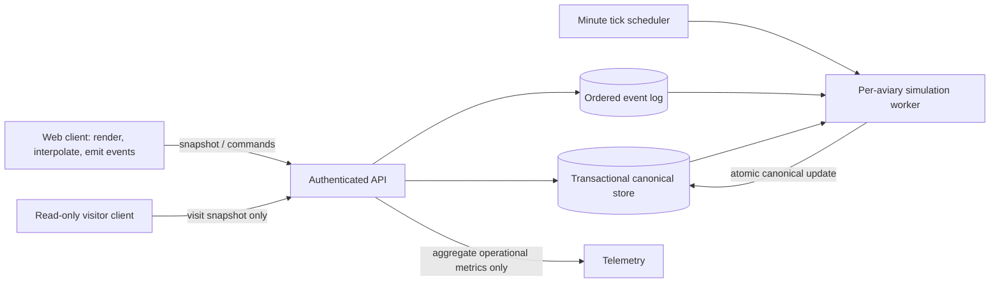

# Pocket Aviary v1 implementation plan

## 1. Product scope and invariants

Ship a browser-only, single-user aviary per account. An account begins with two system-selected birds that the user names; the aviary can grow to seven through age-paced offers, never through visit frequency, attention totals, or spending. V1 includes email magic-link authentication, canonical server simulation and multi-device snapshots, offers, listen-in, settle, presence accounting, the read-only field notebook, optional read-only visits, account/session settings, export and deletion, screen-reader narration, reduced-motion rendering, and procedural call captions/audio.

The experience must remain observational and quiet: no score, streak, achievement, hunger, distress, punishment for absence, public discovery, native client, multi-aviary account, user-arranged perches, shared aviary, or push engagement loop. Keep personality values off all interactive client surfaces. Use naturalist lowercase, present-tense prose for bird observations; use direct matter-of-fact copy for identity, settings, errors, accessibility settings, and sync.

Treat these as system invariants, enforced at service boundaries:

- The server is the only writer of canonical bird personality and mood. Clients submit events, never state replacements.
- Only the host's qualifying presence and interactions affect the host's simulation. Visit sessions are read-only and never count as presence.
- Presence requires visible document, focused window, and recent pointer or key activity simultaneously. Tab-open time alone does not count.
- Personality changes are slow and monotonic toward expressive on positive signals. Absence creates no negative trait delta and no distress state.
- Bird IDs are stable across rename, sync, and migrations. Names are presentation fields.
- A maximum of seven distinct call signatures is supported. There are no recorded-call fallback assets.
- Per-account events and simulation state never enter aggregate telemetry, recommendation, or training pipelines.

## 2. Architecture and ownership

Use a small web client, an authenticated application API, and a server-side simulation service backed by a transactional relational store and a durable per-aviary event queue/log. A scheduler enqueues approximately one simulation tick per minute for each aviary, including inactive accounts. A worker consumes each aviary's pending events in order, applies deterministic time-based simulation, and commits state plus the consumed-event cursor atomically. Partition work by synthetic `account_id`/`aviary_id`; serialize writes per aviary. Store times in UTC and retain the account's IANA timezone for local day/night and mood inputs.

Keep service responsibilities distinct:

- **Identity/account service:** magic links, device sessions, email verification/change, deletion lifecycle, export authorization. Generate a random synthetic UUID at account creation. Store email encrypted on the account record; never put email in IDs, partitions, logs, traces, or analytics.
- **Aviary API:** authorization, snapshot serialization, event validation/append, invitation management, notebook pagination, and account settings. Enforce role-specific schemas so visit credentials cannot invoke host mutations.
- **Simulation worker:** sole writer of canonical moods, personality vectors, bird positions, call schedules, ambient state, and notebook observations. It consumes an ordered event cursor and records an idempotent tick/version.
- **Web client:** requests snapshots, renders/interpolates, maintains ephemeral audio/render state, and reports qualifying presence plus deliberate interactions. It does not simulate the persistent world or compute drift.

Do not place bird-state payloads in shared public caches. To meet first-render goals, deliver a small authenticated, private/no-store bootstrap snapshot from an edge-adjacent path or inline it in a personalized HTML response; cache only static assets publicly. If no authenticated snapshot is available quickly, draw the quiet field (not a spinner), then place the birds into already-progressing poses as soon as the snapshot arrives.

## 3. Data model

Persist canonical data with explicit ownership and versioning. Suggested records:

- **Account:** synthetic UUID, encrypted verified email, IANA timezone, creation/deletion timestamps, notification and accessibility preferences. One active aviary per account.
- **DeviceSession / MagicLink:** hashed opaque token, account/device IDs, issue/expiry/consumption/revocation times. Magic links expire in 15 minutes and are single-use. Device sessions can be individually revoked. Email changes remain pending until new-address verification.
- **Aviary:** stable ID, account ID, created-at, canonical version, last tick time, local-time configuration, scene/weather state, next bird-offer age threshold, and simulation event cursor.
- **Bird:** stable ID, aviary ID, species, user name, adoption time, server-only normalized personality vector (boldness, social warmth, vocal frequency, plumage saturation, curiosity), persisted mood and mood timer, current perch/pose, motif-library key, call schedule/seed, and last state update. Never expose the vector in snapshot or UI DTOs.
- **InteractionEvent:** immutable event ID/idempotency key, aviary and optional bird IDs, type, validated payload, server receive time, client event time for diagnostics only, and monotonic per-aviary sequence. Types include presence start/heartbeat/end, listen-in start/end, offer, settle, and undo-settle. Do not accept client trait deltas.
- **Presence window:** server-derived qualifying intervals and last-valid-heartbeat time, with bounds to prevent offline/backdated accumulation. End on visibility/focus/activity timeout, explicit settle, session revocation, or tab-close signal. Closing without settle has no penalty.
- **NotebookEntry:** generated by simulation from noteworthy aviary observations, stable ID, creation time, prose/template key, referenced bird IDs, and rendered naturalist copy. Read-only and indefinitely scrollable while the account exists. Never write entries about visit frequency or user streaks.
- **VisitInvitation / VisitSession:** invitation ID, host aviary, invited email encrypted at rest, random token hash, status, created/expiry/revocation/first-use timestamps; visit session ID, start/end/last-pull time and the visitor email reference needed for the host's on-demand visit log. Expire unused invites after 30 days. Do not record visitor attention as host presence.
- **Idempotency and outbox cursor:** retain event dedupe keys and delivery/processing cursor long enough to make retries safe; compact processed detail when no longer required by simulation. Avoid an indefinitely growing analytics copy of interaction events.

The export section asks for personality vectors while the shared vocabulary and engine make their numeric values categorically hidden. Follow the stronger hidden-vector invariant: export an account/aviary snapshot without numeric personality values; include bird identity, names, species, visible mood/state, notebook, and settings. Record this PRD conflict for resolution before any export contract is frozen. Deletion marks the account immediately, allows signed-in recovery for 30 days, then removes all associated account, bird, event, notebook, session, invitation, and telemetry-linked records. Export is generated on demand and sent as a time-limited download link to the verified email.

## 4. API surface and authorization

Use versioned JSON APIs over TLS with short-lived session credentials, schema validation, rate limits, and stable error codes. All mutation endpoints require an idempotency key. Snapshot and notebook responses carry canonical version/cursor values; client timestamps never order canonical writes.

**Authentication and account**

- `POST /v1/auth/magic-links` requests a link, rate-limited per email; respond uniformly to avoid account enumeration.
- `POST /v1/auth/magic-links/consume` atomically consumes the 15-minute token and creates a per-device session.
- `GET/DELETE /v1/account/sessions`, `POST /v1/account/email-change`, and verification endpoints manage sessions and verified email changes.
- `POST /v1/account/exports` queues an on-demand JSON export; `POST /v1/account/deletion` begins the reversible 30-day deletion period; a signed-in recovery action cancels it.

**Aviary and events**

- `GET /v1/aviary/snapshot` returns version, server time, timezone-derived phase, weather, scene transitions, and for each bird only its stable ID, name, species, visible pose/perch/mood representation, current call schedule/motif parameters, and active transition hints. No personality numbers or internal event history. The client pulls at open, visibility return, long frame gap, and low-frequency visible keepalive.
- `POST /v1/aviary/events` accepts one or a small batch of typed events with unique IDs. Server validates ownership, offer cooldown (few minutes per bird), one active listen-in target, settle/undo window (five seconds), and presence conditions. Duplicate IDs return the original acknowledgement. Worker application remains ordered; API acknowledgement means accepted, not already simulated.
- `GET /v1/aviary/notebook?cursor=...` returns sparse, read-only observation entries in reverse chronological pages.
- `POST /v1/aviary/birds/{id}/rename` changes only the display name. Bird adoption offers are server-generated according to aviary age; accepting one creates the next stable bird identity, never exceeding seven.

**Visit invitation**

- `POST /v1/visits/invitations` takes a specific visitor email and sends a one-time opaque link; default is off because no invite exists until explicitly sent.
- `GET /v1/visits` lists outstanding invitations and the host's visit log (visitor email, date, approximate duration); `DELETE /v1/visits/invitations/{id}` revokes an unused or active invite.
- `POST /v1/visits/consume` validates the invitation and starts a read-only visit session. `GET /v1/visits/{token}/snapshot` returns the same current aviary view; authorization cannot call `/events`, settle, notebook mutation, or host account APIs. Revocation is checked on every snapshot pull and terminates access on the next pull.

No client-to-client replication or last-write-wins merge is needed. If a stale client submits an event, it remains an event against a stable bird ID and the server applies it once in order or returns a matter-of-fact expired-session/invalid-target error. It cannot overwrite a newer vector.

## 5. Simulation engine

Implement the worker as a deterministic reducer: `(canonical_state, ordered_events, tick_time, seeded_rng) -> (new_state, notebook_observations, consumed_cursor)`. Store simulation version and RNG seed so deployments can replay fixtures and migrations without changing bird identity. Bound work per tick and process overdue time in capped deterministic intervals after outages rather than applying a huge catch-up jump.

**Presence and drift.** The client emits presence heartbeats only while `visibilityState === visible`, the window is focused, and a pointer move or keypress occurred within a configurable “few minutes” window. A reasonable initial calibration is a two-minute activity window and a short heartbeat cadence; make both server-configurable. Server timestamps and validates the interval, clamps gaps, deduplicates retries, and closes it on timeout or settle. Presence duration is the dominant input; listen-in adds a smaller focused-bird signal; offers add small trait-specific signals; settle ends presence and quiets mood without adding a trait direction. Visitors never emit eligible host presence.

Use per-trait low-pass accumulated evidence and small bounded positive deltas: qualifying presence nudges expressive traits; listen-in preferentially nudges that bird's warmth/vocal frequency; a received/accepted offer nudges curiosity and presence near a bird can nudge boldness. Clamp to configured scalar ranges, make deltas nonnegative, and prevent one session from producing a perceptible step. Lack of events does not lower any value. Calibrate offline/replay fixtures so a typical regular-use trace produces measurable instrument drift around one week and perceivable behavior/plumage differences around three weeks, without exposing numbers or introducing click-to-progress loops. “Quieter after absence” should come from current time, mood, and lack of fresh greeting cues, never a negative personality delta or distress mechanic.

**Mood, ambient behavior, and age.** Persist one mood per bird (wary, content, curious, drowsy, alert as initial enum), transitions, and timers. Each minute tick considers recent host events, local time, rare weather, neighboring calls/alarm events, and the bird's personality as a probability bias; mood survives sessions and advances while no client is connected. Run a daily-ish reconciliation/reset as a bounded mood transition, not a tab-open reset. Night settles most birds while the nightjar-like species may remain active. Rain briefly damps calls; wind may make birds alert or wary. Weather is rare, soft, and short-lived. Use aviary age alone to schedule additional bird offers; configure and calibrate month-scale intervals, with no visit-count or interaction threshold.

**Call grammar and notebook.** Each of roughly six coherent species has a motif library and stable signature. Server state provides timing/mood/trait-shaped motif parameters and call scheduling; client synthesis varies pitch, envelope, spacing, and motif combinations within each recognizable identity. The engine creates notebook observations only for meaningful moments, approximately every few days at regular usage, with stronger noteworthy moments eligible sooner. Use reviewed naturalist templates/grammar tied to facts (which bird greeted first, weather, perch, calls), not generic event logs, numerical drift, user activity counts, or unconstrained generated claims.

## 6. Client render and interaction pipeline

Build a single responsive horizontal scene with three perch zones, stable framing for all birds, quiet foreground/background, subdued palette, local-time day/night color, and rare ambient leaf/feather motion. Do not add panning, zoom, bird dragging, badges, hover labels, or controls over the scene. Keep the sparse top bar above it (account/settings, accessibility settings, notebook, offer). Fade the bar after cursor stillness and restore it on pointer or keyboard activity.

Pipeline: authenticate and fetch private bootstrap snapshot; initialize the scene at its current pose/time; draw the first bird without waiting for noncritical assets; start interpolation and ambient render; reconcile future snapshots by version. The scene renderer consumes immutable view snapshots plus ephemeral interpolation state. Keep persistent decisions and transitions in the simulation service; the client interpolates positions/poses and audio envelopes only. Use compact SVG/vector or procedural bird assets and an efficient Canvas/SVG composition; cap draw work to visible scene needs, reuse objects/buffers, and stop rendering when hidden while server ticking continues. Avoid a fade-from-static or spinner. The empty scene exists only between adoption and first bird; the first adopted bird's entry is a soft fly-in.

At idle, motion is mood-shaped and continuous: wary birds sit back and scan, content birds preen, curious birds tilt toward sounds, drowsy birds sit low and fluffed. Return greeting is a single bird selected from current boldness/mood/absence, procedurally varied; any second response is staggered. It must not create a textual “welcome back” surface. Listen-in is a gradual mix rebalance, never silencing other birds; it disengages on refocus, second bird, empty scene click, or keyboard focus departure. Offers originate from the top-bar affordance, select seed/song-fragment/still-pool, and show mood/personality-shaped reactions. Settle gently warms evening light and quiets calls; any scene click within five seconds undoes it. Tab close and settle both end presence without penalty.

Honor `prefers-reduced-motion` and the in-product setting with a designed still-pose cross-fade mode: remove leaf drift, replace flight paths with perch cross-fades, slow ambient lighting shifts, and retain the same moods, calls/captions, interactions, and notebook. Keep state changes and narration independent of frame rate.

## 7. Audio and captions

Create one bounded WebAudio graph per active browser session. Synthesize every call client-side from the compact motif library; use deterministic per-bird seeds plus variation per call so signatures persist while exact calls do not repeat. Shape timing and pitch by server schedule/mood/personality, and mix at most seven voices with a chorus bus and soft ambient bed. On listen-in, ramp focused-bird gain up and others down to ambient over a slow curve; reverse the curve on disengage. Settle reduces call activity and master level gradually. Reuse oscillators/buffers where practical, stop/dispose scheduled nodes, and close contexts when the session ends.

Generate each caption from the same motif parameters actually synthesized (for example, “a soft three-note rise”), positioned near the calling bird and faded with the call. Enable captions by default if WebAudio is unavailable or context startup is denied; never substitute recordings. Browser autoplay policies may prevent audible calls before a user gesture even though the scene must arrive mid-motion. Resume WebAudio on the first permitted interaction or explicit audio preference action, keep captions available, and avoid a welcome/toast announcement. Make this browser-policy limitation an acceptance and design calibration item rather than silently shipping repeated audio failures.

## 8. Accessibility, account surfaces, and voice

Provide a semantic scene model alongside the visual renderer. Keyboard order is top bar, then first bird; arrow keys move among birds, Enter starts listen-in, Escape exits, and offer/settle/notebook controls remain keyboard-operable. Use visible high-contrast focus outlines across day/night backgrounds and WCAG AA contrast for every user-copy surface. Test with keyboard alone and screen readers.

Generate screen-reader prose from the same snapshot/event facts as the scene and notebook, not a list of coordinates, status labels, or personality data. Speak a naturalist update at roughly 30–60 second idle cadence, with a restrained priority update for user-initiated greeting, offer reaction, and settle. Queue/coalesce updates so a burst cannot overwhelm assistive technology. Call captions describe the actual procedural motif in the same naturalist voice. Keep account, error, sync, and accessibility-setting copy matter-of-fact, including expired/revoked invite and unsupported-browser surfaces.

## 9. Performance, observability, and privacy

Budgets are release gates: initial JS under 2 MB gzipped; first bird visible under 500 ms on mid-tier mobile/4G; 60 fps idle on a five-year-old mid-range laptop; no client memory growth across a 30-minute session; tick latency p99 below the 5-second alert threshold. Code-split account/accessibility settings, invitation, and notebook routes. Load scene-critical assets first; lazy-load noncritical UI. Benchmark the signed-in snapshot path, not just a public cache path.

Build synthetic browser runs from common geographies and aggregate-only RUM for navigation, first-bird render, frame times, audio-context errors, snapshot/tick latency, API errors, and memory trend. Strip account IDs, bird IDs, per-bird payloads, presence intervals, and interaction detail before metrics leave the product services. Never dimension operational telemetry by account; telemetry pipelines cannot query the simulation database. Avoid product analytics for visits, drift, session frequency, or bird behavior. Operational logs should use request correlation IDs with bounded retention and no email or bird prose.

## 10. Rollout and release sequence

1. **Foundation:** schema and identity boundaries, private snapshot path, event sequencing/idempotency, deletion/export lifecycle, simulation replay fixtures, and telemetry redaction. Establish service and privacy review before real accounts.
2. **Two-bird private alpha:** magic link, adoption/naming, canonical tick, time-of-day moods, presence, return greeting, scene rendering, and procedural calls. Tune stability and recognizability at two birds; verify client/server state boundaries.
3. **Accessible v1 surface:** ship narration, captions, reduced-motion, keyboard navigation, contrast, WebAudio graceful silence, notebook and account settings with the same launch cohort. These are launch requirements, not a later phase.
4. **Broader v1:** enable offers, settle, sparse notebook generation, invitations/visit log and revocation. Validate read-only authorization and ensure visitor sessions cannot alter host state.
5. **Age-based population ramp:** begin all accounts with two; enable age-paced bird offers conservatively and expand observed supported cohorts toward the seven-bird cap only after call intelligibility, render, audio-mix, and memory budgets hold at each count. The offer schedule keys only on aviary age; never gate by engagement or telemetry-derived user segments.

Roll out with server flags and rollback for tick/model versions and optional social entry points. Keep migrations backward-readable; preserve vector and bird IDs across every version. Day-one operational measures are aggregate service health only. Do not add user-facing progress counters or notification loops during launch.

## 11. Main risks and mitigations

- **Drift feels inert or too fast:** use deterministic multi-week replay scenarios and blinded qualitative review at one and three weeks; calibrate low-pass constants and caps server-side. Protect monotonicity and no-negative-absence behavior with invariant checks.
- **Duplicate or lost events across devices:** enforce per-aviary ordering, idempotency keys, transactionally committed cursors, retries, and replayable tick inputs. Simulate concurrent sessions and worker retries before launch; no client absolute-state writes.
- **Mood or local-time discontinuities:** store IANA timezone and UTC tick instants; cover daylight-saving changes and device timezone changes with explicit timezone update semantics. Never reset mood just because a tab opens.
- **Calls sound synthetic, repetitive, or indistinguishable:** preserve a species motif signature while varying exact timing; audition mixes from two through seven voices, including mobile speakers. Do not solve a poor signature with recordings or increased bird count.
- **Autoplay restrictions make the opening feel silent:** treat browser gesture gating as expected, render captions when unavailable, and verify first-gesture resume across supported browsers. Avoid an intrusive prompt.
- **Accessible surfaces regress or become noisy:** keep narration cadence/coalescing and reduced-motion as first-class release criteria; conduct screen-reader and keyboard reviews for every interaction. Test captions against generated audio parameters.
- **Presence is overcounted or undercounted:** instrument only aggregate technical heartbeat validity, not account-level attention; calibrate the few-minute activity window so quiet watching counts but abandoned tabs do not.
- **Visitor token leakage or lingering access:** hash opaque invite tokens, scope them to one host/aviary and read-only claims, expire unused links at 30 days, check revocation on each pull, and rate-limit consumption. No visitor events enter the host event stream.
- **Privacy and spec conflicts:** enforce UUID-only internal IDs and telemetry isolation. Resolve the vector-export conflict before freezing export contract. Keep the social visited-notification toggle off by default; if honored as the specific social exception, send only after explicit opt-in and keep visit log silent otherwise.
- **Performance degrades with growth:** test at seven birds, bound audio nodes and client objects, watch aggregate budgets, and pause age-based population expansion if any budget regresses.
