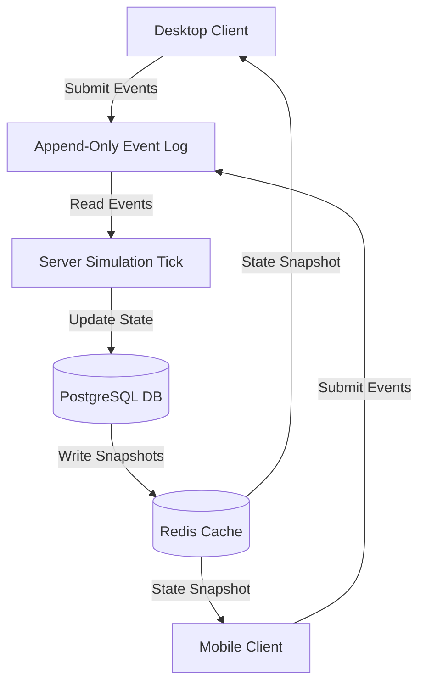

# Pocket Aviary - V1 Implementation Plan

This document details the complete, production-grade technical implementation plan for Pocket Aviary V1. It provides concrete database schemas, API specs, mathematical models for personality drift, state machine definitions for mood, WebAudio synthesizer topologies, and accessibility architecture.

---

## 1. Scope & Non-Goals

### 1.1 V1 Scope
The initial release of Pocket Aviary comprises the following core components:
- **Horizontal Aviary View**: A single responsive horizontal scene (no scrolling, panning, or zooming) containing between two (starter) and seven (cap) birds.
- **Naturalist Experience**: Observer-focused interaction with no quests, scores, or gamified mechanics.
- **Session Interactions**: 
  - **Return-Greeting**: Randomly-staggered, mood-and-boldness-influenced greetings when the user returns.
  - **Listen-in**: Audio focus of a single bird using a slow mix ramp.
  - **Offers**: Cooldown-bounded gestures (seed, song fragment, still pool).
  - **Settle**: An opt-in evening lighting shift to close a session with an undo window.
  - **Field Notebook**: Sparsely generated naturalist prose entries documenting events.
- **Server-Side Simulation**: A background tick engine (~once per minute) advancing bird mood, applying drift, and persisting the canonical aviary state.
- **Accounts & Auth**: Passwordless email magic-link sign-in with 15-minute link expiration and automatic consumption invalidation.
- **Multi-Device Sync**: Server-canonical state synchronization across mobile and desktop browser sessions.
- **Visits**: Revocable, read-only guest sharing via private email invitation links (expires after 30 days). No co-presence or guest-driven drift.
- **Accessibility & Performance**: Running screen-reader narration, reduced-motion pose cross-fades, call captioning, keyboard navigation, <2MB bundle budget, and <500ms time-to-first-bird.

### 1.2 Non-Goals
The following features are strictly out of scope for V1 and will not be designed or implemented:
- **Native Applications**: No iOS or Android native wrappers; web-only target using standard responsive layouts.
- **Custodial tamagotchi-like mechanics**: Birds cannot die, fall ill, or show distress. Neglect results in ambient quietness (monotonic positive drift towards expressiveness only).
- **Gamification**: No streaks, XP, level counters, calendar green dots, stats dashboards, or badges.
- **Social Networks**: No public discovery feeds, likes, comments, guest avatars, or mutual co-present visits.
- **Monetization/Billing**: No subscription tiers or payment flows.
- **Customization**: No user-configurable scene layouts, decorations, or customizable colors.

---

## 2. Architecture & Service Shape

The system uses a decoupled client-server architecture. The server acts as the single source of truth for the simulation state, while the client acts as a pure rendering and audio synthesis engine.



### 2.1 Component Split
- **Backend Service (API & Simulation)**:
  - Written in TypeScript (Node.js/Express) or Go.
  - **REST API Server**: Handles authentication, profile management, magic links, event ingestion, and invitations.
  - **Simulation Engine**: A background worker ticking every 60 seconds. Consumes the append-only interaction event log, recalculates personality vectors and mood transitions, updates the DB, and invalidates/refreshes the latest state cache.
- **Storage Layer**:
  - **PostgreSQL**: Primary transactional database storing user records, bird configurations, notebook entries, and active invitations.
  - **Redis**: Caches the pre-computed, compressed JSON state snapshot for each active aviary.
- **Frontend SPA**:
  - Written in HTML5, Vanilla CSS, and modern TypeScript (compiled with Vite).
  - **Audio Pipeline**: Synthesizes procedural bird calls via WebAudio API based on rulesets and seeds sent in the state snapshot.
  - **Render Engine**: Canvas 2D or lightweight WebGL (PixiJS) drawing three parallax layers at 60fps.

### 2.2 Rendering Boundary
The client never runs simulation physics or computes personality/mood. Instead, it reads a sequence-numbered snapshot:
$$\text{Snapshot } S_k = \{ t_k, \mathbf{B}_k \}$$
where $\mathbf{B}_k$ represents the state vectors of all birds at timestamp $t_k$. The client uses this state to interpolate visual coordinates, select preening animations, and configure the audio nodes. When the document is hidden (`visibilityState == 'hidden'`), the client pauses the RAF loop and WebAudio context but does not stop the server from continuing its 60-second tick cycle.

---

## 3. Data Model

### 3.1 PII Isolation and Encryption
To prevent PII leakage into logs, caches, and telemetry, the `Account` table isolates the user's email.
- The `email` column is encrypted using AES-256-GCM.
- An unindexed, one-way hash `email_hash = HMAC-SHA256(email, server_salt)` is used for lookup during sign-in.
- All internal tables reference a synthetic UUIDv4 `account_id` as their foreign key.

### 3.2 SQL Schema (Ddl)

```sql
-- Accounts & Profiles
CREATE TABLE accounts (
    id UUID PRIMARY KEY DEFAULT gen_random_uuid(),
    email_hash VARCHAR(64) UNIQUE NOT NULL,
    email_encrypted BYTEA NOT NULL,
    created_at TIMESTAMP WITH TIME ZONE DEFAULT CURRENT_TIMESTAMP NOT NULL,
    updated_at TIMESTAMP WITH TIME ZONE DEFAULT CURRENT_TIMESTAMP NOT NULL,
    deletion_pending_at TIMESTAMP WITH TIME ZONE NULL,
    settings JSONB DEFAULT '{"accessibility": {"reduced_motion": false, "captions": false}, "notifications": {"visit": false}}'::jsonb NOT NULL
);

-- Birds
CREATE TABLE birds (
    id UUID PRIMARY KEY DEFAULT gen_random_uuid(),
    account_id UUID REFERENCES accounts(id) ON DELETE CASCADE NOT NULL,
    name VARCHAR(50) NOT NULL,
    species_id VARCHAR(30) NOT NULL,
    adopted_at TIMESTAMP WITH TIME ZONE DEFAULT CURRENT_TIMESTAMP NOT NULL,
    -- Personality Vector (All bounded [0.0, 1.0])
    boldness DOUBLE PRECISION DEFAULT 0.2 NOT NULL,
    social_warmth DOUBLE PRECISION DEFAULT 0.2 NOT NULL,
    vocal_frequency DOUBLE PRECISION DEFAULT 0.3 NOT NULL,
    plumage_saturation DOUBLE PRECISION DEFAULT 0.1 NOT NULL,
    curiosity DOUBLE PRECISION DEFAULT 0.2 NOT NULL,
    -- Mood State
    current_mood VARCHAR(20) DEFAULT 'wary' NOT NULL,
    mood_updated_at TIMESTAMP WITH TIME ZONE DEFAULT CURRENT_TIMESTAMP NOT NULL,
    -- Layout Positional State
    current_perch VARCHAR(10) DEFAULT 'back' NOT NULL,
    last_perch_change_at TIMESTAMP WITH TIME ZONE DEFAULT CURRENT_TIMESTAMP NOT NULL
);

-- Append-Only Interaction Event Log
CREATE TABLE interaction_events (
    id UUID PRIMARY KEY DEFAULT gen_random_uuid(),
    account_id UUID REFERENCES accounts(id) ON DELETE CASCADE NOT NULL,
    session_id UUID NOT NULL,
    event_type VARCHAR(30) NOT NULL, -- 'presence_ping', 'offer_seed', 'offer_song', 'offer_pool', 'listen_in_start', 'listen_in_end', 'settle'
    target_bird_id UUID REFERENCES birds(id) ON DELETE CASCADE NULL,
    duration_seconds INT DEFAULT 0 NOT NULL,
    created_at TIMESTAMP WITH TIME ZONE DEFAULT CURRENT_TIMESTAMP NOT NULL
);

-- Field Notebook
CREATE TABLE notebook_entries (
    id UUID PRIMARY KEY DEFAULT gen_random_uuid(),
    account_id UUID REFERENCES accounts(id) ON DELETE CASCADE NOT NULL,
    entry_text TEXT NOT NULL,
    created_at TIMESTAMP WITH TIME ZONE DEFAULT CURRENT_TIMESTAMP NOT NULL
);

-- Visit Invitations
CREATE TABLE visit_invitations (
    id UUID PRIMARY KEY DEFAULT gen_random_uuid(),
    host_account_id UUID REFERENCES accounts(id) ON DELETE CASCADE NOT NULL,
    visitor_email_hash VARCHAR(64) NOT NULL,
    token_hash VARCHAR(64) UNIQUE NOT NULL,
    created_at TIMESTAMP WITH TIME ZONE DEFAULT CURRENT_TIMESTAMP NOT NULL,
    expires_at TIMESTAMP WITH TIME ZONE NOT NULL,
    revoked_at TIMESTAMP WITH TIME ZONE NULL
);
```

---

## 4. API Surface

All API communication uses JSON. Authorized endpoints require a `Authorization: Bearer <session_token>` header.

### 4.1 Client -> Server Endpoints

#### `POST /api/auth/magic-link`
Requests a magic login link to be emailed.
- **Request Body**:
  ```json
  { "email": "user@example.com" }
  ```
- **Response** (Matter-of-fact tone on error, otherwise simple status):
  ```json
  { "status": "success", "message": "If the email matches an account, we sent a link." }
  ```

#### `POST /api/auth/verify`
Exchanges the token from the magic link for a session token.
- **Request Body**:
  ```json
  { "token": "ml_token_string_here" }
  ```
- **Response**:
  ```json
  {
    "status": "success",
    "session_token": "sess_uuid_xyz",
    "expires_at": "2026-05-21T07:17:55Z"
  }
  ```

#### `GET /api/aviary/state`
Returns the cached state snapshot of the user's aviary.
- **Response**:
  ```json
  {
    "aviary": {
      "time_of_day": "07:17:55",
      "weather": "clear",
      "weather_intensity": 0.0,
      "settled": false,
      "birds": [
        {
          "id": "bird-uuid-1",
          "name": "Pip",
          "species_id": "pip",
          "plumage_saturation": 0.15,
          "current_perch": "front",
          "current_mood": "curious",
          "call_seed": 45892,
          "animation_pose": "preen"
        },
        {
          "id": "bird-uuid-2",
          "name": "Wren",
          "species_id": "wren",
          "plumage_saturation": 0.12,
          "current_perch": "back",
          "current_mood": "wary",
          "call_seed": 10294,
          "animation_pose": "idle"
        }
      ]
    }
  }
  ```

#### `POST /api/aviary/events`
Ingests batched interaction events from the client.
- **Request Body**:
  ```json
  {
    "session_id": "session-uuid-123",
    "events": [
      {
        "event_type": "presence_ping",
        "created_at": "2026-05-20T14:18:00Z"
      },
      {
        "event_type": "listen_in_start",
        "target_bird_id": "bird-uuid-1",
        "created_at": "2026-05-20T14:19:00Z"
      }
    ]
  }
  ```
- **Response**:
  ```json
  { "status": "success", "processed_count": 2 }
  ```

### 4.2 Guest Invitation & Sharing

#### `POST /api/visits/invite`
Generates a sharing link for a guest email.
- **Request Body**:
  ```json
  { "visitor_email": "friend@example.com" }
  ```
- **Response**:
  ```json
  {
    "status": "success",
    "invite_id": "invite-uuid-abc",
    "link": "https://pocketaviary.com/visit/invite_token_xyz"
  }
  ```

#### `POST /api/visits/revoke`
Revokes an active invitation immediately.
- **Request Body**:
  ```json
  { "invite_id": "invite-uuid-abc" }
  ```
- **Response**:
  ```json
  { "status": "success" }
  ```

#### `GET /api/visits/:token/state`
Returns the read-only visual snapshot of the host's aviary. Event submissions via the visitor session are rejected.
- **Response**:
  *Same payload structure as `/api/aviary/state`.*

---

## 5. Simulation Engine Design

### 5.1 Tick Loop
The simulation runs on a cron-like ticker on the server, executing once per minute. It processes only active accounts (accounts with presence events recorded within the last 15 minutes, or those undergoing transition checks).

```
For each active aviary:
  1. Retrieve all interaction_events since last tick.
  2. Compute accumulated presence duration.
  3. Calculate personality vector updates using monotonic drift.
  4. Evaluate and transition mood states.
  5. If conditions met, generate sparse naturalist field notebook entry.
  6. Write updated states to PostgreSQL & flush cache in Redis.
```

### 5.2 Drift Function (Low-Pass Filter)
Let $P_i(t) \in [0, 1]$ be the personality trait $i$ of a bird at tick $t$. Let $E$ be the set of interaction events consumed during the tick interval.
We define a monotonic update model where values never decrease:
$$P_i(t) = P_i(t-1) + \Delta P_i$$
$$\Delta P_i = \min \left( \alpha_i \cdot \sum_{e \in E} w_{i, e} \cdot \delta_e, \gamma_i \right) \cdot (1 - P_i(t-1))$$

Where:
- $\alpha_i$ is the base drift coefficient.
- $w_{i, e}$ is the event-type weight for trait $i$.
- $\delta_e$ is the duration (for presence pings or listen-in) or count (for offers) of event $e$.
- $\gamma_i$ is a per-tick capping factor to prevent state saturation from session spamming.
- $(1 - P_i(t-1))$ acts as a soft saturation limit, ensuring smooth asymptotic growth toward $1.0$.

#### Calibration Target Values
To guarantee that 1 week of daily 15-minute visits ($\approx 105$ minutes total) results in a measurable instrument change ($\approx +0.05$) and 3 weeks results in a visible user difference ($\approx +0.15$):
- Set base presence coefficient $\alpha_{\text{presence}} = 4.5 \times 10^{-4}$ per minute of presence.
- Capping factor $\gamma = 0.01$ per tick.
- This ensures that a bird at starting value $0.2$ watching for $15$ minutes accumulates:
  $$\Delta P \approx 15 \times 4.5 \times 10^{-4} \times (1 - 0.2) \approx 0.0054 \text{ per day}$$
  - **7 Days (105 min)**: $\approx +0.037$ drift.
  - **21 Days (315 min)**: $\approx +0.11$ drift.
- Listen-in weight multiplier $w_{\text{warmth}, \text{listen}} = 1.8$ on focused birds.

### 5.3 Mood Transition Model
Mood is simulated as a Finite State Machine with probabilistic transition matrices. The state space is $S = \{\text{wary}, \text{content}, \text{curious}, \text{drowsy}, \text{alert}\}$.

The transition probability $P(S_j \mid S_i)$ from current mood $S_i$ to target mood $S_j$ is given by:
$$P(S_j \mid S_i) = \text{softmax} \left( \mathbf{M}_{i, j} + \beta_{\text{time}}(t) + \beta_{\text{weather}}(w) + \beta_{\text{interact}}(E) + \lambda \cdot P_{\text{boldness}} \right)$$

where:
- $\mathbf{M}$ is the baseline mood transition matrix.
- $\beta_{\text{time}}$ adjusts for time-of-day (e.g., higher bias to transition to `drowsy` when local time is between 20:00 and 06:00).
- $\beta_{\text{weather}}$ biases transitions (e.g., `rain` increases the probability of transitioning to `wary`).
- $\beta_{\text{interact}}$ models interaction spikes (e.g., a successful seed offer increases transition odds to `content`).
- $\lambda \cdot P_{\text{boldness}}$ leverages the bird's underlying personality trait to resist negative transitions (high boldness dampens the transition to `wary` on rain or user absence).

#### Probabilistic Transition Matrix
| Source \ Target | Wary | Content | Curious | Drowsy | Alert |
| :--- | :--- | :--- | :--- | :--- | :--- |
| **Wary** | 0.70 | 0.10 | 0.05 | 0.05 | 0.10 |
| **Content** | 0.05 | 0.75 | 0.10 | 0.08 | 0.02 |
| **Curious** | 0.05 | 0.15 | 0.70 | 0.02 | 0.08 |
| **Drowsy** | 0.05 | 0.15 | 0.02 | 0.75 | 0.03 |
| **Alert** | 0.10 | 0.05 | 0.15 | 0.02 | 0.68 |

### 5.4 Call-Grammar Runtime Rules
Calls are structured as a hierarchy of notes defined client-side, executed by a seed number generated in the server-side state.
- **Motif Library**: A map of frequency intervals and durations.
- **Sequence Compiler**:
  ```typescript
  interface Note {
    frequency: number; // Hz
    duration: number;  // ms
    type: 'sine' | 'triangle' | 'fm';
    gain: number;
  }
  ```
- The server snapshot passes a deterministic seed (`call_seed`). The client generates note sequences using a seedable pseudo-random number generator (e.g., LCG). This guarantees that the bird's call remains recognizable and repeatable for the same state, while varying by mood parameters (e.g., alert raises pitch offset by $+50\text{ Hz}$; drowsy slows note duration by $1.5\times$).

---

## 6. Sync & Consistency Model

Multi-device conflicts are structurally avoided by centralizing logic on the server.

```
       [ Client A ]                [ Server ]                [ Client B ]
            |                          |                          |
            |--- 1. Presence Event --->|                          |
            |                           |--- 2. Write to Log       |
            |                          |                          |
            |                          |--- 3. Tick & Update ---->| (Pulls new state)
            |                          |      Personality Vector  |
            |                          |                          |
            |<-- 4. Pulls state -------|                          |
```

### 6.1 Event Flow vs State Setting
- **Rule**: Clients NEVER send absolute values for personality vectors, mood, or coordinate positions.
- **Log Processing**: Clients write to `/api/aviary/events` appending events. The server simulation tick consumes these events, applying updates sequentially.
- **Concurrent Devices**: If Client A (laptop) and Client B (phone) are open simultaneously:
  - Both submit presence events.
  - The server processes them sequentially. Total presence time is computed as the union of active ranges (avoiding double-counting overlapping windows).
  - Both clients fetch the updated state snapshot via polling or HTTP SSE.

### 6.2 Session End (Settle vs. Close)
- When the user triggers the `Settle` action:
  1. The client immediately sends a `settle` event to the API.
  2. The server records the event, changing the aviary status to `settled` in the next tick.
  3. The client initiates a slow evening fade.
- When the user closes the tab:
  1. The browser's `beforeunload` event sends a final batch of events via `navigator.sendBeacon`.
  2. If the beacon fails due to network drop, the server marks presence as inactive when no `presence_ping` is received for more than 3 minutes.
  3. No user penalties or warnings occur on raw tab-close.

---

## 7. Frontend Rendering Pipeline

Pocket Aviary renders on a single canvas element using 2D context or WebGL (PixiJS) to satisfy the 60fps budget.

### 7.1 Visual Scene Layers
1. **Background**: Low-contrast sky color gradient and distant static tree silhouettes.
2. **Midground**: Middle perches, bird nodes, interactable pools, seeds, and shadows.
3. **Foreground**: High-contrast leafy branches framing the view, performing subtle wind-rippled parallax offset.

```
+-------------------------------------------------------------+
|  Top Bar (Chrome, settings, notebook, offer icons)          |
+-------------------------------------------------------------+
|                                                             |
|   \ \ \  Leaves drifting (ambient)                  / / /   |
|     +------------+                                          |
|     | Back Perch |  [Bird: Wren]                            |
|     +------------+                                          |
|                         +--------------+                    |
|                         | Middle Perch |                    |
|                         +--------------+                    |
|        +-------------+                                      |
|        | Front Perch |  [Bird: Pip]                         |
|        +-------------+                                      |
|                                                             |
+-------------------------------------------------------------+
```

### 7.2 Idle Micro-Motion
- Birds animate using skeletal sprite-sheets or Canvas path deformation.
- Idle micro-motions (head-tilts, weight shifting, preening, breathing) are driven by randomized timers triggered when the bird is in the `idle` animation state.
- Coordinate coordinates are calculated using cubic Bezier curves during fly-in transitions:
  $$B(t) = (1-t)^3 P_0 + 3(1-t)^2 t P_1 + 3(1-t) t^2 P_2 + t^3 P_3$$
  where $P_0$ is the start perch, $P_3$ is the target perch, and $P_1, P_2$ are control handles.

### 7.3 Reduced-Motion Mode
When `prefers-reduced-motion` is active:
- All frame-by-frame asset animations are disabled.
- Fly-in Bezier transitions are replaced by a **1.5-second cross-fade** (linear interpolation of global alpha) between perch coordinates.
- Idle animations transition between still keyframes using opacity fades over 1.0 second.
- Ambient leaf and feather drift systems are completely disabled (particle generator remains inactive).
- Parallax effects on scroll/pointer movements are disabled.

---

## 8. Audio Pipeline

The procedural audio engine uses the WebAudio API to synthesize naturalistic sounds.

### 8.1 Synthesizer Architecture (Fm)
To synthesis a clean bird call, the client instantiates a mini FM synthesizer network:

```
[Modulator Oscillator] -> [Modulator Gain] -> [Carrier Oscillator (Freq)]
                                                      |
                                                      v
                                               [Envelop GainNode]
                                                      |
                                                      v
                                              [BiquadFilterNode]
                                                      |
                                                      v
                                                [PannerNode] -> [Master Mix]
```

```typescript
class BirdCallSynthesizer {
  private ctx: AudioContext;

  constructor(ctx: AudioContext) {
    this.ctx = ctx;
  }

  public playCall(motif: Note[], panValue: number) {
    const now = this.ctx.currentTime;
    
    // Nodes
    const carrier = this.ctx.createOscillator();
    const modulator = this.ctx.createOscillator();
    const modGain = this.ctx.createGain();
    const envelope = this.ctx.createGain();
    const filter = this.ctx.createBiquadFilter();
    const panner = this.ctx.createPanner();

    // Routing
    modulator.connect(modGain);
    modGain.connect(carrier.frequency);
    carrier.connect(envelope);
    envelope.connect(filter);
    filter.connect(panner);
    panner.connect(this.ctx.destination);

    // Pan setting
    panner.panningModel = 'HRTF';
    panner.pan.setValueAtTime(panValue, now);

    // Scheduling
    let timeOffset = 0;
    motif.forEach(note => {
      const start = now + timeOffset;
      const end = start + (note.duration / 1000);

      // Pitch envelope
      carrier.frequency.setValueAtTime(note.frequency, start);
      modulator.frequency.setValueAtTime(note.frequency * 2, start);
      modGain.gain.setValueAtTime(note.frequency * 0.5, start);

      // Volume envelope
      envelope.gain.setValueAtTime(0, start);
      envelope.gain.linearRampToValueAtTime(note.gain, start + 0.02);
      envelope.gain.exponentialRampToValueAtTime(0.0001, end);

      timeOffset += (note.duration / 1000) + 0.05; // Note spacing
    });

    modulator.start(now);
    carrier.start(now);
    
    modulator.stop(now + timeOffset);
    carrier.stop(now + timeOffset);
  }
}
```

### 8.2 Chorus Mixing & Listen-In Decay
- Ambient environmental sound (wind/rain) is generated using a White Noise node passed through a low-frequency sweep filter.
- **Listen-In Transition**:
  - When the user selects a bird, the client executes a cross-fade of master gains over 1.5 seconds.
  - The focused bird's `PannerNode` shifts to center ($0.0$).
  - Gain of the focused bird remains at $1.0$.
  - The background nodes and all other birds' GainNodes fade exponentially to $0.1$:
    ```typescript
    nonFocusedGainNode.gain.exponentialRampToValueAtTime(0.1, ctx.currentTime + 1.5);
    ```

### 8.3 WebAudio Fallback
- If the browser does not support `AudioContext` or user interaction permissions are blocked:
  1. The client catches the initialization error silently.
  2. Configures the UI with a mute icon status.
  3. Enables `captions` automatically in user settings.
  4. Renders call descriptions visually via onscreen captions near the birds.

---

## 9. Accessibility Surfaces

Accessibility is treated as a core product feature.

### 9.1 Screen-Reader Narration
- A hidden DOM element with `role="log"` and `aria-live="polite"` is updated with descriptive prose.
- **Cadence**: Updates occur every 45 seconds during idle, and immediately upon user interactions (e.g. "pip approaches the seed and eats," "the aviary settles into the warm evening light").
- **Voice Engine**: The server-side simulation evaluates the physical coordinates, weather, and time of day, compiling it into naturalist prose rather than raw status lines:
  - *Sighted representation*: Bird positioned at coordinates $(120, 450)$ preening.
  - *Screen-Reader narration*: "a small grey bird is perched on the front rail, calling softly. another bird sits further back with feathers fluffed. it is morning in the aviary; the light is gentle."

### 9.2 Call Captioning
- Call captions appear visually as absolute-positioned labels overlaying the Canvas:
  ```html
  <div class="call-caption" style="left: 45%; top: 30%">
    [a low trill, paused, low trill again]
  </div>
  ```
- These transition in and out with CSS opacity matching the WebAudio synthesis envelope.

### 9.3 Keyboard Map
| Key | Target | Action |
| :--- | :--- | :--- |
| **Tab** | Top Bar Controls | Focuses settings, notebook, and offers. |
| **Arrow Left / Right** | Birds | Moves active keyboard focus ring between birds in the aviary. |
| **Enter** | Focused Bird | Initiates the `Listen-In` focus interaction. |
| **Escape** | Focused Bird | Cancels the active `Listen-In` interaction. |

Focus outlines are styled as custom high-contrast CSS outline rules with a glowing offset to be visible against day, night, and evening background textures.

---

## 10. Performance Budgets & Observability

### 10.1 Budgets
- **Initial JS Bundle Size**: `<2MB (gzipped)` total. Hitting this requires using dynamic import code-splitting for non-essential components (Settings, Notebook content, Visit management).
- **Time-to-First-Bird**: `<500ms`. Hitting this requires:
  1. Server injection of the initial state snapshot JSON directly inside the main HTML template (`<script id="initial-state">...</script>`).
  2. Minimal synchronous scripts in the `<head>`.
  3. Preloading critical SVGs and bird skeleton models.
- **Runtime Frames**: `60fps` steady on 5-year-old mid-range laptops.
- **Memory Footprint**: Strict zero memory leak policy. Verified by automated CI runs running Chrome Headless for 30 minutes, measuring JS Heap size increments.

### 10.2 Observability & Telemetry (No PII)
- Collect anonymized performance statistics:
  - Page load time (Navigation Timing API).
  - Time to first rendering of a bird.
  - WebAudio buffer utilization and context error rate.
  - Page frame-rate drops.
- **Telemetry Boundaries**:
  - Event payloads sent to metrics aggregators must never contain user email hashes, names of birds, or raw text observations.
  - Latency check: If the simulation tick queue latency p99 exceeds 5 seconds, fire alerts to pager.

---

## 11. Rollout & Tuning

### 11.1 Adoption & Age-Based Ramping
- Starter state adopts exactly 2 birds.
- Age-based availability thresholds (measured in days since account creation):
  - **Day 7**: Third bird slot unlocked.
  - **Day 30**: Fourth bird slot unlocked.
  - **Day 90**: Fifth bird slot unlocked.
  - **Day 180**: Sixth bird slot unlocked.
  - **Day 365**: Seventh (max) bird slot unlocked.
- Offers appear as gentle, non-obtrusive events in the field notebook ("a new species has been spotted nearby").

### 11.2 Calibration Testing
Before public launch, the drift weights and mood transition parameters are verified against simulation test harnesses:
- **Synthetic Test harness**: Simulates 10,000 parallel accounts executing varying presence logs.
- Asserts that personality variables remain strictly bounded $[0, 1]$, and drift curves match design specs.

---

## 12. Risks & Mitigations

### 12.1 Calibration Divergence
- *Risk*: Users leaving tabs open or using headless scripts might accelerate drift to saturation instantly.
- *Mitigation*: The tick simulation engine enforces a strict cap on maximum drift increments ($\gamma_i = 0.01$ per tick) and utilizes a strict union model for overlapping presence signals.

### 12.2 Audio Uncanniness
- *Risk*: Procedural WebAudio synthesis sounds artificial, shrill, or like a broken retro synthesizer.
- *Mitigation*: Calibrate the low-pass filter decay parameters and utilize small random pitch modulations (frequency jitter) to mimic organic vocalization fluctuations.

### 12.3 Sync and Link Replay
- *Risk*: A user copies the magic link, opening it on multiple devices or replaying expired sessions to corrupt state.
- *Mitigation*: Magic link tokens are one-time-use. On verification request, the token is deleted from the DB instantly, preventing replay attacks. Session sync is driven by polling the central Redis state rather than clients editing the state.

### 12.4 Accessibility Drift
- *Risk*: Sighted features (new bird animations, weather visuals) get added but narration and caption tracks fall out of sync.
- *Mitigation*: Enforce a strict integration test suite where all state-to-narrator compile rules are verified against mock states. Accessibility changes must merge inside the same pull request as the visual update.
