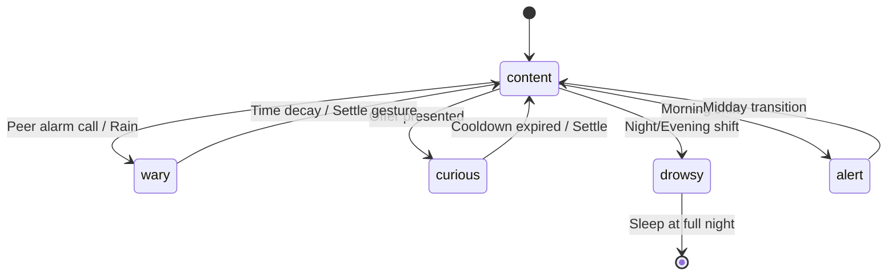

# Implementation Plan - Pocket Aviary (Wave 003, Run 001)

This document outlines the comprehensive technical implementation plan for Pocket Aviary v1. It provides concrete engineering specifications, data schemas, API contracts, architectural boundaries, and mathematical formulations for the system, fully respecting the constraints, goals, and non-goals defined in the product requirements.

---

## 1. Scope and Boundaries

### 1.1 In-Scope Features (v1)
- **Bird Adoption & Population Scaling**: Newly adopted aviaries initialize with exactly two starter birds. The maximum bird count per aviary is strictly capped at seven birds. Unlocking additional birds is chronologically paced based on the calendar age of the aviary account (relationship deepening) rather than user interaction metrics.
- **Interactive Session Elements**:
  - *Return-Greeting*: A procedural, staggered welcoming action when a session begins, varying by absence length, bird boldness, and current mood.
  - *Presence Tracking*: Precise client-side tracking of user attention, requiring page visibility, focus, and pointer/key events.
  - *Listen-In*: Gradual audio fading that brings one selected bird to the foreground while others fade to a low ambient level.
  - *Offers*: Gifting seeds, water pools, or melodic motifs with a per-bird cooldown.
  - *Settle Gesture*: An opt-in soft session-end action that shifts light to evening, quiets calls, and implements a 5-second undo grace period.
- **Field Notebook**: A sparse, auto-generated, read-only observer log written in a naturalist field-notebook voice.
- **Accessibility Support**:
  - Screen-reader narration using naturalist prose updated on a slow cadence (30–60 seconds) via `aria-live`.
  - Reduced-motion mode replacing smooth paths and micro-animations with slow cross-fades.
  - Dynamic call captioning displaying naturalist descriptions of calling patterns.
  - Full keyboard navigation and WCAG AA contrast compliance.
- **Identity, Auth, and Sync**: Single-user accounts signed in via 15-minute email magic links, syncing a single canonical aviary state across multiple devices.

### 1.2 Out-of-Scope Features (Explicit Exclusions)
- **No Native Clients**: Web-only at v1. The data structures and API boundaries will be optimized for standard web protocols (HTTP, WebAudio).
- **No Gamification Elements**: Absolutely no achievements, streaks, XP, level systems, green-dot calendars, badges, or numeric metrics displayed to the user.
- **No Custodial/Tamagotchi Mechanics**: Birds cannot die, fall ill, starve, or show distress. Neglect results in quiet ambient behavior rather than punishment or visible sadness.
- **No Social Network Features**: No public discovery, leaderboards, shared or mutual aviaries, comments, chat, avatars, or co-presence indicators.
- **No Default Push Notifications**: The system will not push, ping, or email users about the aviary unless a host explicitly opts in to receive email notifications when a friend uses their visit link.

---

## 2. System Architecture

The architecture uses a strict **Client-Server split** where the server holds the single source of truth for the aviary state, and the client serves as an interactive rendering and audio synthesis layer.

```mermaid
graph TD
    subgraph Client [Client Browser]
        UI[Aviary UI / Canvas Render]
        Audio[WebAudio Synth Engine]
        Presence[Presence Monitor]
        ClientState[Client Local Cache]
    end
    subgraph Server [Backend System]
        API[Express API Layer]
        Sim[Simulation Engine / Tick Job]
        DB[(PostgreSQL Database)]
        Cache[(Redis Event Log / Sessions)]
    end

    UI -->|1. GET Snapshot| API
    Presence -->|2. POST Interaction Event| API
    API -->|Write Event| Cache
    API -->|Read Snapshot| DB
    Sim -->|3. Periodic Tick (~1m)| DB
    Sim -->|Read Events| Cache
    DB -->|State Updates| ClientState
    ClientState --> UI
    ClientState --> Audio
```

### 2.1 Component Boundaries
1. **The Client (Browser SPA)**:
   - Receives JSON-formatted aviary state snapshots from the server.
   - Interpolates coordinates and mood parameters between successive snapshots to render smooth animations.
   - Synthesizes all audio in real time using the WebAudio API based on procedural grammars.
   - Monitors browser visibility, focus, and pointer/key events to send periodic presence pings.
2. **The Server (Node.js/TypeScript REST API)**:
   - Handles email-based magic link authentication and issues session tokens.
   - Manages an append-only transaction/event queue (in-memory or Redis) for interaction events.
   - Executes a periodic background process (the simulation tick) to compute state updates.
3. **Database Layer (Relational Store)**:
   - Houses account credentials (encrypted email, synthetic IDs), bird records, persistent personality vectors, current moods, field notebook entries, and social visit invitations.

---

## 3. Data Model

### 3.1 Relational Database Schema
To prevent PII leakage and ensure data integrity, internal database tables reference accounts via a synthetic `account_id` (UUID). The email address is stored encrypted in a single column in the `accounts` table.

```sql
-- Accounts Table
CREATE TABLE accounts (
    id UUID PRIMARY KEY DEFAULT gen_random_uuid(),
    encrypted_email BYTEA NOT NULL,
    created_at TIMESTAMP WITH TIME ZONE DEFAULT CURRENT_TIMESTAMP,
    status VARCHAR(32) NOT NULL DEFAULT 'active', -- active, marked_for_deletion, deleted
    deletion_requested_at TIMESTAMP WITH TIME ZONE
);

-- Sessions Table
CREATE TABLE sessions (
    id UUID PRIMARY KEY DEFAULT gen_random_uuid(),
    account_id UUID NOT NULL REFERENCES accounts(id) ON DELETE CASCADE,
    token_hash VARCHAR(256) NOT NULL UNIQUE,
    device_info TEXT,
    created_at TIMESTAMP WITH TIME ZONE DEFAULT CURRENT_TIMESTAMP,
    expires_at TIMESTAMP WITH TIME ZONE NOT NULL,
    revoked BOOLEAN NOT NULL DEFAULT FALSE
);

-- Birds Table
CREATE TABLE birds (
    id UUID PRIMARY KEY DEFAULT gen_random_uuid(),
    account_id UUID NOT NULL REFERENCES accounts(id) ON DELETE CASCADE,
    name VARCHAR(64) NOT NULL,
    species VARCHAR(64) NOT NULL,
    boldness DOUBLE PRECISION NOT NULL DEFAULT 0.2, -- [0.0, 1.0]
    social_warmth DOUBLE PRECISION NOT NULL DEFAULT 0.2, -- [0.0, 1.0]
    vocal_frequency DOUBLE PRECISION NOT NULL DEFAULT 0.2, -- [0.0, 1.0]
    plumage_saturation DOUBLE PRECISION NOT NULL DEFAULT 0.2, -- [0.0, 1.0]
    curiosity DOUBLE PRECISION NOT NULL DEFAULT 0.2, -- [0.0, 1.0]
    current_mood VARCHAR(32) NOT NULL DEFAULT 'content',
    mood_expiry TIMESTAMP WITH TIME ZONE,
    perch_zone VARCHAR(16) NOT NULL DEFAULT 'middle', -- front, middle, back
    adopted_at TIMESTAMP WITH TIME ZONE DEFAULT CURRENT_TIMESTAMP
);

-- Interaction Events Log
CREATE TABLE interaction_events (
    id UUID PRIMARY KEY DEFAULT gen_random_uuid(),
    account_id UUID NOT NULL REFERENCES accounts(id) ON DELETE CASCADE,
    bird_id UUID REFERENCES birds(id) ON DELETE SET NULL,
    event_type VARCHAR(64) NOT NULL, -- presence_ping, offer_seed, offer_song, offer_pool, listen_in_start, listen_in_end, settle, return_greeting
    timestamp TIMESTAMP WITH TIME ZONE DEFAULT CURRENT_TIMESTAMP,
    details JSONB
);

-- Field Notebook Entries
CREATE TABLE notebook_entries (
    id UUID PRIMARY KEY DEFAULT gen_random_uuid(),
    account_id UUID NOT NULL REFERENCES accounts(id) ON DELETE CASCADE,
    timestamp TIMESTAMP WITH TIME ZONE DEFAULT CURRENT_TIMESTAMP,
    entry_text TEXT NOT NULL
);

-- Visit Invitations
CREATE TABLE visit_invitations (
    id UUID PRIMARY KEY DEFAULT gen_random_uuid(),
    host_account_id UUID NOT NULL REFERENCES accounts(id) ON DELETE CASCADE,
    visitor_email_hash VARCHAR(256) NOT NULL,
    token VARCHAR(128) NOT NULL UNIQUE,
    status VARCHAR(32) NOT NULL DEFAULT 'active', -- active, revoked, expired
    created_at TIMESTAMP WITH TIME ZONE DEFAULT CURRENT_TIMESTAMP,
    expires_at TIMESTAMP WITH TIME ZONE NOT NULL
);

-- Visit Log
CREATE TABLE visit_log (
    id UUID PRIMARY KEY DEFAULT gen_random_uuid(),
    host_account_id UUID NOT NULL REFERENCES accounts(id) ON DELETE CASCADE,
    visitor_email_hash VARCHAR(256) NOT NULL,
    timestamp TIMESTAMP WITH TIME ZONE DEFAULT CURRENT_TIMESTAMP,
    duration_seconds INTEGER
);
```

---

## 4. API Surface

The API acts as a transaction boundary. To protect the core design intent, **no endpoint ever exposes raw floating-point values of a bird's personality vector** (`boldness`, `social_warmth`, etc.) to the client.

### 4.1 Client Endpoints

#### Authentication
- `POST /api/auth/magic-link`:
  - Request: `{ "email": "string" }`
  - Action: Generate a random 64-character token, store in Redis with a 15-minute TTL, send link to email.
- `POST /api/auth/verify`:
  - Request: `{ "token": "string" }`
  - Response: Set HttpOnly session cookie, returns user status.

#### Aviary State
- `GET /api/aviary/snapshot`:
  - Response:
    ```json
    {
      "server_time": "2026-05-20T14:58:30Z",
      "light_state": "morning", -- morning, midday, evening, night
      "weather_state": {
        "condition": "clear", -- clear, rain, wind
        "intensity": 0.0
      },
      "birds": [
        {
          "id": "uuid-1",
          "name": "Pip",
          "species": "warbler",
          "current_mood": "curious",
          "perch_zone": "front",
          "plumage_saturation": 0.45
        },
        {
          "id": "uuid-2",
          "name": "Wren",
          "species": "sparrow",
          "current_mood": "drowsy",
          "perch_zone": "back",
          "plumage_saturation": 0.32
        }
      ]
    }
    ```

#### Interaction Events Submission
- `POST /api/aviary/events`:
  - Request:
    ```json
    {
      "event_type": "presence_ping", -- or "offer", "listen_in_start", "listen_in_end", "settle"
      "bird_id": "uuid-1", -- optional
      "details": {
        "offer_type": "seed" -- if event_type is "offer"
      }
    }
    ```
  - Response: `{ "status": "accepted" }`

#### Field Notebook
- `GET /api/aviary/notebook`:
  - Response:
    ```json
    {
      "entries": [
        {
          "timestamp": "2026-05-20T08:12:00Z",
          "entry_text": "tuesday — pip greeted before wren today, first time this week."
        }
      ]
    }
    ```

### 4.2 Visit-Invitation Endpoints (Social Opt-In)
- `POST /api/social/invite`:
  - Request: `{ "visitor_email": "friend@example.com" }`
  - Action: Generate invitation link, send to visitor.
- `GET /api/social/visit/:token`:
  - Action: Verifies token validity and retrieves the host's aviary snapshot. Returns read-only snapshot.
  - Constraint: Rejects any POST interaction calls originating from this token.
- `DELETE /api/social/invite/:invite_id`:
  - Action: Instantly marks invitation as revoked. Active visitor sessions will fail on their next snapshot pull.

---

## 5. Simulation Engine Design

### 5.1 The Server-Side Tick
A scheduler executes the simulation tick precisely once per minute. The process follows a serialized transactional sequence:
1. Fetch all unresolved `interaction_events` for active accounts.
2. Group events by `account_id`.
3. For each active aviary:
   - Compute total deduplicated presence time within the tick interval.
   - Run the Monotonic Drift function on personality vectors.
   - Run the Mood Transition State Machine for each bird.
   - Run Ambient Event generator (weather, bird-to-bird cues).
   - Write updated bird metrics and new notebook entries.
   - Mark events as processed.

### 5.2 Presence Time Calculation
The client posts `presence_ping` events every 30 seconds.
- **Server Rule**: Deduplicate concurrent active devices. Within a 60-second tick interval, if multiple sessions record focus and activity, the accumulated presence time is capped at exactly 60 seconds.
- **Presence Validation**: Only register pings where `visibilityState == 'visible'`, the window has focus, and client-side keyboard/pointer activity has occurred within a 3-minute sliding window.

### 5.3 Monotonic Drift Function
Let $P_i$ be a personality trait (e.g. `boldness`). Traits are updated as a low-pass filter:
$$P_i(t + \Delta t) = P_i(t) + \Delta P_i$$

Where:
$$\Delta P_i = \max\left(0, \gamma_i \cdot \frac{\text{PresenceTime}}{\tau} + \sum_{k} w_{i,k} \cdot \text{Event}_k\right)$$

- $\tau$ is the system calibration constant representing 3 weeks of regular visits ($\approx 1.8 \times 10^6$ seconds of active presence).
- $\gamma_i$ is the weight coefficient for presence.
- $w_{i,k}$ represents weights for specific interaction events (e.g., focusing a bird during `listen_in` gives a small positive weight to its `social_warmth`).
- **Constraint**: Because $\Delta P_i \ge 0$, traits never decay, fulfilling the "no Tamagotchi punishment" rule. If ignored, a bird does not become hostile; it becomes ambient because its traits remain flat while mood factors quiet down.

### 5.4 Mood Transition State Machine
Mood is a fast-timescale state machine evaluated at each tick:



- **Transition Modulators**:
  - *Time of Day*: At evening, transition probability to `drowsy` scales exponentially.
  - *Ambient Weather*: Rain increases transition likelihood to `wary` or `drowsy`.
  - *Personality Dampener*: High `boldness` reduces the transition probability to `wary` by a factor of $(1.0 - \text{boldness})$.

### 5.5 Call-Grammar Runtime
A bird's call is structured as a recursive formal grammar expanded client-side:
- `Call -> Greeting | Chorus | Solitary`
- `Solitary -> Motif PhraseSeparator? Motif?`
- `Motif -> ToneSequence Envelope`

The client-side parser takes a JSON definition of a bird's species grammar and modulates the generated WebAudio nodes:
- **Tempo Modulation**: Controlled by `vocal_frequency` and `current_mood`. `drowsy` introduces a longer delay between motif tones; `alert` sharpens tone attack times and decreases delay.
- **Pitch Modulation**: Higher `boldness` slightly shifts the fundamental frequency up. A `wary` mood shifts the filter cutoff lower to produce muffled, hesitant calls.

---

## 6. Sync and Conflict Resolution Model

### 6.1 Server-Authoritative Delta Writes
To prevent multi-device conflicts (e.g., when a user keeps both their mobile browser and laptop browser open), the client **never submits absolute state values**.

- **Incorrect Pattern (Last-Write-Wins)**:
  `Client A sends { boldness: 0.45 }` -> `Client B sends { boldness: 0.40 } (overwriting A)`
- **Correct Pattern (Event Queue)**:
  `Client A sends { event: "presence", duration: 30 }` -> `Client B sends { event: "presence", duration: 30 }` -> Server tick dedupes and applies a single delta update to database state.

### 6.2 Interpolated Rendering Pipeline
Since state snapshots are pulled at a low frequency, the client uses an interpolation buffer:
- The client maintains the current state $S_{active}$ and target state $S_{target}$.
- Position transitions (e.g., when a bird moves from the `middle` to the `front` perch) are drawn using a Cubic Bezier curve over $2.0$ seconds:
  $$x(t) = (1-t)^3 x_0 + 3(1-t)^2 t x_{control1} + 3(1-t) t^2 x_{control2} + t^3 x_1$$
- If a client misses a snapshot check-in due to network latency, the birds default to their current perch zone's idle loop, preventing "snapping" or abrupt teleports.

---

## 7. Frontend Rendering Pipeline

The visual scene is drawn to a single HTML5 `<canvas>` element to maintain a high frame rate and allow custom rendering controls.

### 7.1 Layer Composition
1. **Layer 0 (Sky Backdrop)**: Rendered as a linear gradient. The color stops shift smoothly based on local system time (e.g., deep blue/black at night, soft gold/rose at dawn, bright sky blue at midday).
2. **Layer 1 (Background Parallax)**: SVGs of distant hills and trees. Translates slightly based on cursor coordinate $x_{cursor}$ with factor $f = 0.02$.
3. **Layer 2 (Middle Ground)**: Perches (wooden rails, branches), still water pool, and active bird models.
4. **Layer 3 (Foreground Parallax)**: Overhanging leaves and branches. Translates with factor $f = -0.05$.

### 7.2 Idle Micro-Motion Equations
Birds are never statically frozen. They execute continuous micro-motions:
- **Respiration**:
  $$\text{ScaleY}(t) = 1.0 + 0.015 \cdot \sin(2\pi \cdot f_{resp} \cdot t)$$
- **Head Tilting**:
  Every $4.0 + \text{random}() \cdot 6.0$ seconds, if mood is `curious` or `alert`, trigger a head tilt. The tilt angle $\theta$ interpolates from $0$ to $\pm 15^\circ$ using a smoothstep filter:
  $$S(x) = 3x^2 - 2x^3$$

### 7.3 Reduced-Motion Specification
If `prefers-reduced-motion` is detected:
1. Parallax translations are completely disabled.
2. Flight paths between perches are replaced by a **cross-fade transition**:
   - The bird at Perch A slowly dims: $\text{opacity} = 1.0 - t/T$.
   - The bird at Perch B slowly brightens: $\text{opacity} = t/T$.
   - Cross-fade duration $T = 600\text{ms}$.
3. Ambient leaf and feather drift animations are removed.

---

## 8. WebAudio Pipeline

All sounds are synthesized procedural audio, avoiding static samples.

```
                  [ LFO (Vibrato) ]
                          | (modulates frequency)
                          v
[ Noise Gen ]      [ OscillatorNode (Sine/Tri) ]
      |                   |
      v                   v
[ BiquadFilter ] -> [ GainNode (Envelope) ] -> [ StereoPannerNode ] -> [ Master Gain ] -> [ Destination ]
```

### 8.1 Sound Generation Mechanics
1. **Tonal Synthesis**: An `OscillatorNode` (Sine or Triangle) modulated by a low-frequency oscillator (`LFO`) to simulate natural avian vibrato.
2. **Breathy Texture**: A low-volume white noise generator running through a narrow bandpass `BiquadFilterNode` mixed with the primary oscillator.
3. **Envelope shaping**:
   - *Attack*: 10–30ms to prevent clicking.
   - *Decay & Sustain*: Modulated by call type.
   - *Release*: 20–50ms.

### 8.2 Chorus Mixing and Listen-In Decay
All bird audio sources feed into a central routing system:
- **Default State**: Each bird has an active panning position set by its $x$ coordinate on screen.
- **Listen-In Focus**: When Wren is clicked:
  - Wren's audio node retains its gain scaling ($1.0$).
  - For all other birds, their gain nodes are scheduled to drop to $0.12$ over $1.5$ seconds using `gainNode.gain.linearRampToValueAtTime`.
  - Disengaging listen-in ramps all nodes back to $1.0$ over $1.5$ seconds.

### 8.3 Graceful Fallback
If WebAudio initialization fails or permissions are denied, the audio pipeline goes silent. The client automatically turns on **call captioning** in settings, displaying text captions (e.g. `*a soft, rising warble*`) adjacent to the visual bird model.

---

## 9. Accessibility Surfaces

### 9.1 Screen-Reader Narration
To provide an equivalent experience, the client maintains a hidden DOM element:
```html
<div id="aviary-narration" aria-live="polite" aria-atomic="true"></div>
```
- **Narration Content**: A parser translates active snapshot data into cohesive prose:
  > "it is morning in the aviary; the light is warm. pip is preening on the front rail. wren is watching quietly from the back branch."
- **Cadence Rules**: Updates are throttled to once every 45 seconds during idle, triggering immediately only upon user actions (e.g., after an offer is placed).

### 9.2 Call Captioning
When enabled, captions render within high-contrast containers:
```html
<div class="call-caption" style="position: absolute; left: 120px; top: 340px;">
  a quiet two-note call
</div>
```
- **Contrast Styling**: Pure white text on a semi-transparent dark charcoal background (`rgba(18, 18, 18, 0.85)`), guaranteeing a contrast ratio $> 7:1$, well exceeding WCAG AA standards.

### 9.3 Keyboard Navigation Path
Interactive focus moves in a logical ring layout:
1. `Tab` focuses the top-bar controls sequentially: [Account/Settings] -> [Accessibility Settings] -> [Field Notebook] -> [Offer Panel].
2. Pressing `Tab` once more enters the Aviary Canvas. The first bird (ordered by horizontal position) receives a high-contrast focus ring.
3. `Left/Right Arrow Keys` cycle focus between active birds.
4. `Space` or `Enter` engages `listen-in` on the focused bird.
5. `Escape` exits `listen-in`, returning focus to the bird container.

---

## 10. Performance Budgets and Observability

### 10.1 Budgets
- **Initial JS Bundle Size**: Capped at **1.5MB gzipped**. Heavy framework libraries are excluded. All rendering is written using vanilla Canvas API calls.
- **Time-to-First-Bird**: **<500ms** on mid-tier mobile (4G connection).
  - *Mitigation*: The backend server templates the initial page load, embedding the current state snapshot directly into a global script variable:
    ```html
    <script>window.__INITIAL_STATE__ = { ... };</script>
    ```
    This allows the client to draw the first frame immediately without waiting for a separate fetch call.
- **CPU & Frame Budget**: Steady 60fps at <15% CPU load on a 5-year-old laptop.

### 10.2 Observability Boundaries
- **What is collected (Aggregate Metrics)**:
  - Bundle load durations, first-paint timings, API transaction latency metrics.
  - Page-level JS error rates and WebAudio initialization failures.
  - Tick computation durations (alarm raised if p99 latency $> 5.0$ seconds).
- **What is strictly excluded**:
  - Raw presence-time durations mapped to individual email accounts.
  - Bird names, chosen motifs, or direct interaction history.
  - Any PII fields (emails are stored encrypted and never enter telemetry streams).

---

## 11. Rollout and Adoptions

### 11.1 Adoption and Population Milestones
An aviary's population grows strictly based on the chronological age of the account, avoiding gamified engagement triggers:
- **Day 0**: Aviary initialized with exactly 2 birds.
- **Day 14**: 3rd bird becomes adoptable.
- **Day 45**: 4th bird becomes adoptable.
- **Day 90**: 5th bird becomes adoptable.
- **Day 180**: 6th bird becomes adoptable.
- **Day 360**: 7th bird becomes adoptable (maximum capacity).

### 11.2 Instrumentation & Verification Stages
1. **Stage 1 (System Integrity)**: Run simulated 30-day cron scripts in test environments. Verify that the low-pass filter update updates personality traits smoothly and monotonically.
2. **Stage 2 (Telemetry Validation)**: Audit metrics pipelines to confirm no PII or raw interaction logs cross the privacy boundaries into analytics databases.

---

## 12. Risks & Mitigations

| Risk | Impact | Mitigation Plan |
| :--- | :--- | :--- |
| **Robotic/Uncanny Synthesized Sounds** | Sighted/hearing users find calls artificial, breaking the immersion. | Use FM modulation with low-frequency random perturbations (pink noise) to simulate minor larynx variations. |
| **Sync Race Conditions** | A user closing a laptop and immediately opening a phone experiences state regression. | Implement transactional event logs in Redis. Process updates sequentially using a lock on the `account_id` to ensure ordering. |
| **Drift Calibration Saturation** | Birds reach maximum warmth or boldness too quickly (within days). | Run simulation harnesses mimicking high-frequency users to tune the low-pass filter time constant ($\tau$). |
| **Accessibility Prose Fatigue** | Narration descriptions of visual state updates become repetitive and annoying. | Build a vocabulary matrix with randomized naturalist descriptors (e.g. swapping "fluffed" with "ruffled" or "feather-soft"). |
